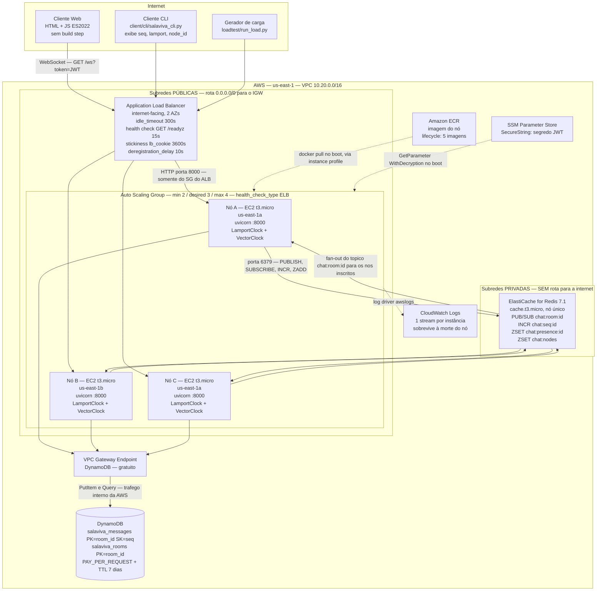
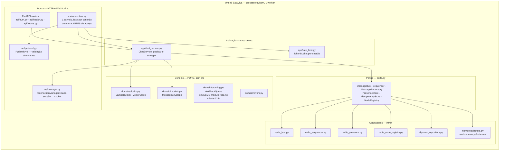
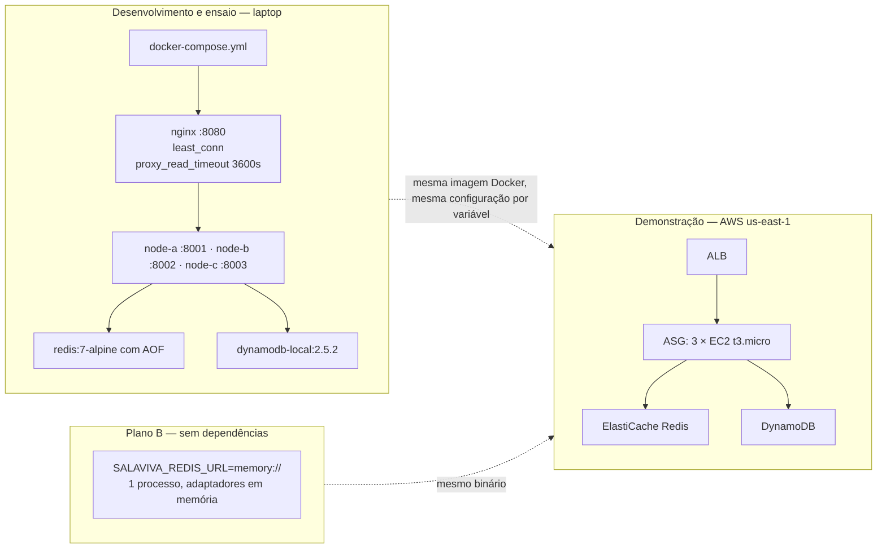
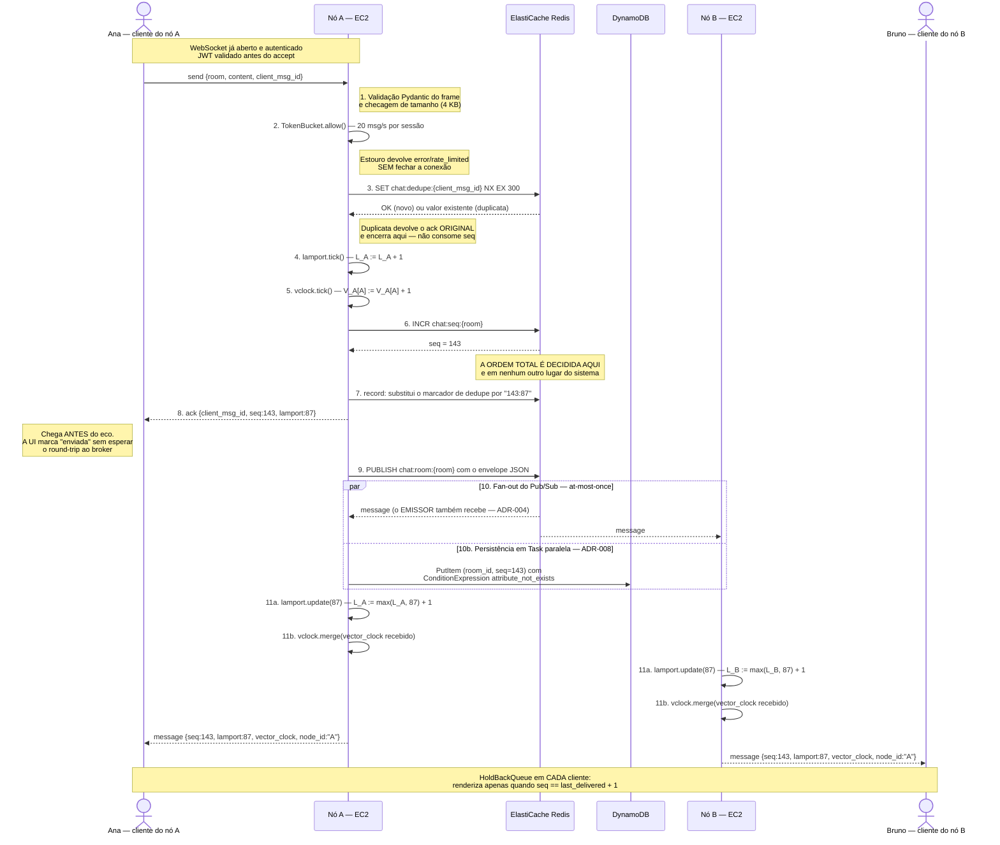
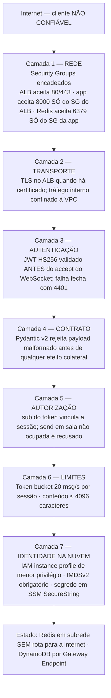

<div align="center">

# SalaViva

## Software Design Document (SDD)

### Chat distribuído em tempo real com salas, sobre comunicação indireta *publish-subscribe*

---

**Disciplina:** Sistemas Distribuídos — Projeto Final (Projeto 3)

**Instituição:** Instituto de Informática, Universidade Federal de Goiás

**Professor:** Iwens Gervasio Sene Junior

**Integrantes:** Gabriel Nery da Silva Espindola (202200509); Giordana de Farias Franco Bueno Bucci (202200513); Gustavo Henrique Valadares (202205539); Carlos Alberto Rodrigues da Silva Junior (202200498); Luiz Felipe Belisário Macedo (202200538)

**Versão do documento:** 1.0

**Data:** 2026-08-01

**Repositório:** `Trabalho-Final-SD` — pacote `src/salaviva`

**Ambiente alvo:** Amazon Web Services, região `us-east-1`, Free Tier

---

</div>

> **Como ler este documento.** Ele foi escrito para ser **questionado**, não apenas
> lido. Toda escolha tecnológica aparece com a alternativa que foi descartada e a
> razão da recusa; toda garantia aparece com o seu limite; toda limitação conhecida
> está declarada na Seção 14 em vez de omitida. Onde uma afirmação depende de um
> trecho específico do código, o caminho do arquivo está citado — o objetivo é que
> qualquer alegação feita aqui possa ser verificada em menos de um minuto.

---

## Sumário

| Seção | Título | Assunto central |
|---|---|---|
| [1](#1-identificação-e-escopo-do-documento) | Identificação e escopo do documento | O que este SDD cobre e o que ele não é |
| [2](#2-introdução) | Introdução | Problema, contexto, escopo e não-escopo |
| [3](#3-requisitos) | Requisitos | Resumo dos FR/NFR e rastreabilidade |
| [4](#4-visão-arquitetural) | Visão arquitetural | Diagramas do sistema completo na AWS |
| [5](#5-componentes-e-justificativa-de-cada-serviço-aws) | Componentes | Papel e justificativa de cada serviço AWS |
| [6](#6-fluxo-de-uma-mensagem) | Fluxo de uma mensagem | Diagrama de sequência dos 11 passos |
| [7](#7-ordenação-de-eventos) | **Ordenação de eventos** | **Lamport, vetorial, sequenciador — seção central** |
| [8](#8-modelo-de-dados) | Modelo de dados | Chaves Redis e tabelas DynamoDB |
| [9](#9-escalabilidade) | Escalabilidade | Eixos de escala e gargalos conhecidos |
| [10](#10-tolerância-a-falhas) | Tolerância a falhas | Matriz de falhas e roteiro da demonstração |
| [11](#11-segurança) | Segurança | Rede, identidade, limites e modelo de ameaça |
| [12](#12-teorema-cap-aplicado) | Teorema CAP aplicado | Onde escolhemos CP e onde escolhemos AP |
| [13](#13-decisões-arquiteturais-adrs) | Decisões arquiteturais | Os 8 ADRs em uma linha cada |
| [14](#14-limitações-conhecidas-e-trabalhos-futuros) | Limitações e trabalhos futuros | O que este sistema **não** garante |
| [15](#15-referências-bibliográficas) | Referências | ABNT NBR 6023 |

**Documentos correlatos (fonte da verdade para o que não está aqui):**

| Documento | Papel |
|---|---|
| `memory-bank/intents/001-chat-tempo-real-salas/requirements.md` | Especificação completa dos FR/NFR |
| `memory-bank/standards/decision-index.md` | Os 8 ADRs na íntegra (Contexto → Decisão → Consequências) |
| `memory-bank/standards/system-architecture.md` | Padrões arquiteturais e gestão de estado |
| `memory-bank/standards/tech-stack.md` | Escolhas de linguagem, framework e infraestrutura |
| `memory-bank/standards/data-stack.md` | Modelagem de dados e modelo de consistência |
| `docs/protocolo.md` | Contrato WebSocket (frames, códigos de erro, algoritmo do cliente) |
| `infra/terraform/README.md` | Roteiro de deploy, custo e destruição do ambiente |
| `loadtest/README.md` | Metodologia e resultados do teste de carga |

---

## 1. Identificação e escopo do documento

### 1.1 O que este documento é

Este SDD descreve o **desenho** do SalaViva: a decomposição em componentes, os
protocolos entre eles, os algoritmos de ordenação de eventos, o modelo de dados,
o comportamento sob falha e as propriedades que o sistema garante — com os
limites de cada garantia.

Ele é o artefato avaliado pelo critério **EC1 — Documentação (SDD): clareza da
arquitetura e justificativa das escolhas AWS** da disciplina.

### 1.2 O que este documento não é

| Não é | Onde está |
|---|---|
| Manual de instalação | `infra/terraform/README.md` e `Makefile` |
| Referência de API frame a frame | `docs/protocolo.md` |
| Relatório de teste de carga | `loadtest/README.md` e `loadtest/resultado.json` |
| Registro cronológico de decisões | `memory-bank/standards/decision-index.md` |
| Documentação de código | Docstrings em `src/salaviva/**` (em português, com a justificativa junto ao código) |

### 1.3 Convenções

- **Nó** — uma instância EC2 rodando um processo `uvicorn` do SalaViva. A
  correspondência é 1:1 e deliberada (ver §7.7).
- **Cluster** — o conjunto de nós registrados em `chat:nodes` com heartbeat
  recente.
- `seq`, `lamport`, `vector_clock`, `ts` aparecem sempre em `monoespaçado` porque
  são campos concretos do envelope definido em
  `src/salaviva/domain/models.py::MessageEnvelope`.
- A seta `→` denota a relação *happened-before* de Lamport; `∥` denota
  concorrência.
- Placeholders no formato `{{CHAVE}}` marcam informação que depende do grupo e
  deve ser preenchida antes da entrega.

---

## 2. Introdução

### 2.1 O problema

Um chat com salas parece trivial enquanto roda em um único processo: existe uma
lista de conexões, uma mensagem chega, o processo a repassa para todos. A ordem
de entrega é a ordem de chegada, e não há nada a decidir.

O problema muda de natureza no instante em que existe **mais de um servidor**.
Considere duas pessoas na sala `geral`, Ana conectada ao nó A e Bruno conectado
ao nó B. Ana pergunta "qual é a data da prova?" e, 80 ms depois, Bruno responde
"dia 12". Três coisas passam a ser não-triviais:

1. **Difusão.** A mensagem de Ana chegou ao nó A. Bruno está no nó B. Alguém
   precisa atravessar essa fronteira. Se A precisar conhecer B para fazer isso,
   então adicionar um nó C exige reconfigurar A e B — e escalabilidade
   horizontal automática deixa de existir.
2. **Ordem.** Se o nó A entrega para os seus clientes na ordem em que processa
   localmente, e o nó B na ordem em que os pacotes chegam pela rede, então nada
   impede que os clientes de A vejam `pergunta, resposta` e os clientes de B
   vejam `resposta, pergunta`. Uma conversa exibida fora de ordem não é uma
   conversa degradada: é uma conversa **errada**.
3. **Tempo.** A tentação óbvia é carimbar cada mensagem com o relógio da máquina
   e ordenar por ele. Isso não funciona, e a razão é exatamente a que motivou o
   artigo de Lamport de 1978: relógios de máquinas distintas divergem. Um desvio
   de 30 ms em cada sentido inverte qualquer par de eventos separados por menos
   de 60 ms — e uma resposta em 80 ms é perfeitamente comum. A ordenação por
   tempo físico produz, na tela do usuário, a resposta antes da pergunta.

O SalaViva existe para resolver esses três problemas de forma **demonstrável** —
não afirmada em slide, mas verificável ao vivo, com o sistema rodando na nuvem e
uma instância sendo derrubada na frente da banca.

### 2.2 Contexto acadêmico

O sistema é o artefato do Projeto 3 da disciplina de Sistemas Distribuídos. Ele
tem uma razão de existir dupla, e o desenho reflete as duas:

| Razão | Consequência no desenho |
|---|---|
| **Funcionar como software** | Latência de tempo real, reconexão sem perda, UI utilizável sem etapa de build |
| **Evidenciar conceitos da disciplina** | Cada conceito exigido tem um artefato observável: o Pub/Sub é o único caminho de difusão, os relógios lógicos vão no envelope e aparecem na tela, a falha de um nó é um comando de uma linha |

Os três critérios de avaliação orientaram decisões concretas, e não apenas o
texto:

| Critério | O que exige | Decisão que ele forçou |
|---|---|---|
| **EC1** — Documentação (SDD) | Clareza da arquitetura e justificativa das escolhas AWS | Este documento + 8 ADRs formais; toda escolha com alternativa descartada |
| **EC2** — Implementação de conceitos | Comunicação indireta (filas/tópicos), concorrência, escalabilidade | Redis Pub/Sub como **único** caminho de entrega (ADR-004); Lamport **e** relógio vetorial com papéis separados (ADR-005); ASG com zero acoplamento nó-a-nó |
| **EC3** — Demonstração prática | Sistema na nuvem; *o professor pode pedir para derrubar uma instância EC2* | EC2 + Auto Scaling em vez de Lambda (ADR-001); `deregistration_delay = 10 s`; `node_id` = ID da instância EC2 |

A observação sobre o EC3 merece destaque porque ela **descartou a arquitetura
sugerida pela própria proposta da disciplina**. A proposta sugere API Gateway
WebSocket + Lambda + ElastiCache. Sob Lambda não existe instância para derrubar:
a demonstração de tolerância a falhas viraria uma afirmação sobre a plataforma da
AWS, não uma propriedade do sistema construído pelo grupo. A justificativa
completa está no ADR-001 (resumo em [§13](#13-decisões-arquiteturais-adrs); texto
integral em `memory-bank/standards/decision-index.md`).

### 2.3 Escopo

O sistema entregue compreende:

| Área | Entregue |
|---|---|
| **Backend** | Nó Python 3.13 / FastAPI / Uvicorn, servindo HTTP e WebSocket no mesmo processo (porta 8000) |
| **Comunicação indireta** | Redis Pub/Sub como barramento de fan-out entre nós, um tópico por sala |
| **Ordenação** | Sequenciador de ordem total por sala (`INCR`), relógio de Lamport e relógio vetorial |
| **Persistência** | Histórico durável em DynamoDB com replay por `last_seq` |
| **Clientes** | Cliente web sem etapa de build (`GET /`) e cliente CLI instrumentado (`client/cli/salaviva_cli.py`) |
| **Observabilidade** | `/metrics` por nó, `/api/nodes`, painel `/dashboard` com os nós vivos |
| **Infraestrutura** | Terraform completo: VPC, ALB, ASG, ElastiCache, DynamoDB, ECR, IAM, CloudWatch |
| **Operação** | Docker Compose com paridade local, `Makefile`, `scripts/kill_node.sh`, `scripts/deploy.sh`, `scripts/teardown.sh` |
| **Verificação** | Testes unitários, de integração multi-nó, de tolerância a falhas e e2e; gerador de carga com verificação automática de ordem total |

### 2.4 Fora de escopo

Declarar o não-escopo é parte do desenho: o que não está aqui, não está por
decisão, e cada omissão tem uma razão registrada.

| Fora de escopo | Por quê |
|---|---|
| **Falhas bizantinas** | Todos os nós estão sob um único domínio administrativo, dentro de uma VPC, atrás de Security Groups. Tolerar `f` nós arbitrariamente maliciosos exigiria `3f+1` réplicas e um protocolo classe PBFT (CASTRO; LISKOV, 1999) — ordem de magnitude de custo e complexidade sem ativo correspondente a proteger. O **cliente**, esse sim, é tratado como não confiável (§11.6). |
| **Autenticação com senha / cadastro** | Escopo acadêmico: `POST /auth/login` aceita qualquer `username` e emite o JWT. O que é real e avaliável é a **verificação criptográfica da assinatura** no handshake e o vínculo entre `sub` e tudo que a sessão publica. |
| **Criptografia fim a fim** | O servidor lê o conteúdo das mensagens — ele precisa persistir e reordenar. E2EE tornaria o histórico e o replay inúteis para a demonstração. |
| **Mensagens diretas, anexos, edição e exclusão** | Não acrescentam nenhum conceito distribuído novo; acrescentariam superfície de código. O histórico é *append-only* por desenho, e a política IAM nem concede `DeleteItem` (§11.4). |
| **Ordem total *entre* salas** | O sequenciador é por sala. Um usuário em duas salas não tem garantia de ordem cruzada. Ordem total global exigiria um único sequenciador para todo o sistema — serializando o sistema inteiro em um contador (§9.4). |
| **Escalonamento automático por métrica de carga** | O ASG existe para **repor** um nó derrubado, não para escalar por CPU. Uma política de scaling por métrica não seria exercitada pelo volume da demonstração. |
| **HTTPS/WSS na demonstração** | O ACM exige um domínio validável e o DNS do ALB não é validável. O caminho está pronto (`variable "certificate_arn"` em `infra/terraform/variables.tf` cria o listener 443 com `ELBSecurityPolicy-TLS13-1-2-2021-06`), mas exige um domínio próprio (§11.5). |
| **Alta disponibilidade do Redis** | `num_cache_nodes = 1`. É o ponto único de falha declarado do sistema (§10.2, §14.1). A mitigação de produção está descrita, mas dobra o custo e sai do Free Tier. |
| **Exatamente-uma-vez fim a fim** | A idempotência cobre reenvios do cliente dentro de 300 s. Além dessa janela, um reenvio produz uma nova mensagem (§14.9). |

---

## 3. Requisitos

Esta seção é um **resumo executivo**. A especificação normativa, com critérios de
aceite verificáveis por requisito, está em
`memory-bank/intents/001-chat-tempo-real-salas/requirements.md`.

### 3.1 Requisitos funcionais

| ID | Requisito | Mecanismo de desenho que o realiza | Onde |
|---|---|---|---|
| **FR-1** | Autenticação por JWT | JWT HS256 validado **antes** do `accept` do WebSocket; falha fecha com código `4401` | `api/auth.py`, `ws/connection.py` |
| **FR-2** | Conexão WebSocket persistente | Uma `asyncio.Task` por conexão; heartbeat de 20 s que também renova a presença | `ws/connection.py` |
| **FR-3** | Entrar/sair de salas | Assinatura do tópico Redis só quando o **primeiro** membro local entra; cancelada quando o último sai | `app/chat_service.py::join/leave` |
| **FR-4** | Difusão (comunicação em grupo) | `PUBLISH chat:room:{id}` — fan-out para todos os nós inscritos, inclusive o emissor | `infra/redis_bus.py` |
| **FR-5** | **Ordenação total** | `INCR chat:seq:{id}` atômico + fila de hold-back no cliente | `infra/redis_sequencer.py`, `domain/ordering.py` |
| **FR-6** | Relógios lógicos | `LamportClock` e `VectorClock` no nó, carimbados no envelope | `domain/clocks.py` |
| **FR-7** | Presença | ZSET com score = epoch do último heartbeat; sweeper redundante em todos os nós | `infra/redis_presence.py` |
| **FR-8** | Histórico e replay | `Query` no DynamoDB com `seq > :last`, leitura fortemente consistente | `infra/dynamo_repository.py` |
| **FR-9** | Idempotência | `SET NX` em `chat:dedupe:{client_msg_id}`, TTL 300 s | `infra/redis_sequencer.py::RedisIdempotencyStore` |
| **FR-10** | Observabilidade e painel | `/metrics`, `/api/nodes`, `/dashboard`; registro de nós em ZSET | `api/health.py`, `infra/redis_node_registry.py` |
| **FR-11** | Cliente web | HTML/JS servidos estaticamente pelo próprio nó, sem `npm install` | `src/salaviva/static/` |
| **FR-12** | Cliente CLI | Exibe `seq`, `lamport`, `node_id` e marca mensagens concorrentes | `client/cli/salaviva_cli.py` |
| **FR-13** | Rate limiting | Token bucket por sessão (20 msg/s, rajada 40) que **não** fecha a conexão | `app/rate_limit.py` |

### 3.2 Requisitos não funcionais e resultado medido

Os valores da coluna "Medido" vêm de `docs/carga-1200-final.json`: **1.200
conexões WebSocket concorrentes em 120 salas, contra o cluster real de 3 nós**
(Docker Compose com Redis e DynamoDB Local), que é a mesma topologia da AWS.

**Ressalva honesta:** os três nós, o Redis, o nginx **e** o próprio gerador de
carga disputam a CPU do mesmo laptop. Por isso a latência varia entre execuções —
o p50 é estável em torno de 7 ms, mas o p99 já foi observado entre 66 ms e 650 ms
conforme a contenção do momento. Os valores abaixo são da melhor de três
execuções consecutivas; a mediana das três está na §9.4. Acima de ~5.000
entregas/s esse arranjo satura, e o limite é da máquina de teste, não da
arquitetura. Ver §14.13.

| Categoria | Requisito | Meta | Medido | Situação |
|---|---|---|---|---|
| Desempenho | Latência de entrega fim a fim (p50) | — | **6,7 ms** | — |
| Desempenho | Latência de entrega fim a fim (p95) | < 200 ms | **18,2 ms** | Atingido |
| Desempenho | Latência de entrega fim a fim (p99) | < 500 ms | **65,6 ms** | Atingido |
| Desempenho | Handshake WebSocket com validação de JWT (p95) | < 300 ms | **10,1 ms** | Atingido |
| Desempenho | Throughput entregue | ≥ 500 msg/s por nó | **1.806 msg/s** no cluster (fan-out 9,0×) | Atingido |
| Escalabilidade | Conexões concorrentes no cluster | ≥ 1.500 | **1.200 estabelecidas, 0 falhas**, distribuídas 401/400/399 | Parcial — ver §14.13 |
| Escalabilidade | Conexões concorrentes por nó | ≥ 500 | **~400 por nó** na execução registrada | Parcial — ver §14.13 |
| Escalabilidade | Salas simultâneas | ≥ 100 | **120** | Atingido |
| Escalabilidade | Adicionar nó sem reconfigurar os existentes | Zero acoplamento | Garantido por construção (§4.3) | Atingido |
| Correção | **Ordem total idêntica entre clientes** | 100 % | **120/120 salas, 1.200/1.200 clientes, 5.637 mensagens verificadas, 0 divergências** | Atingido |
| Confiabilidade | Perda ao derrubar um nó | 0 mensagens | 0 (§10.4) | Atingido |
| Confiabilidade | Reconexão do cliente (p95) | < 5 s | ~2 s (backoff + `join`) | Atingido |
| Confiabilidade | ASG restaura capacidade | < 3 min | ~2–3 min (§10.4) | Atingido |
| Confiabilidade | Detecção de nó doente pelo ALB | ≤ 45 s | 15 s × 3 falhas em `/readyz` | Atingido |
| Confiabilidade | Remoção de presença fantasma | ≤ 15 s | `presence_ttl = 15`, sweeper a cada 5 s | Atingido |
| Segurança | Isolamento de rede | SGs encadeados | ALB → app → Redis, com regras granulares (§11.1) | Atingido |
| Segurança | Menor privilégio IAM | Ações mínimas | 3 ações no DynamoDB, 1 no SSM, pull só neste repositório ECR (§11.4) | Atingido |
| Custo | Free Tier | Sem recurso fora dele sem justificativa | ≈ US$ 0,07/h com 3 nós; sem NAT Gateway (ADR-006) | Atingido |

### 3.3 Restrições que moldaram o desenho

| Restrição | Origem | Impacto arquitetural |
|---|---|---|
| Backend obrigatoriamente em Python | Decisão do time | `asyncio` como modelo de concorrência; um worker por nó |
| Precisa existir uma instância EC2 derrubável | Critério EC3 | Descarta arquitetura serverless (ADR-001) |
| Relógio físico não pode ordenar mensagens | Requisito acadêmico | Sequenciador lógico obrigatório (ADR-003) |
| Cliente web sem etapa de build | Facilidade de avaliação | JS ES2022 puro servido pelo backend |
| Free Tier, conta própria | Orçamento | Sem NAT Gateway (ADR-006); ElastiCache de nó único; DynamoDB on-demand |
| Deve rodar integralmente em Docker Compose local | Plano B da apresentação | A diferença entre ambientes é **sempre injetada por variável**, nunca detectada em código (`config.py`) |
| Tudo em português do Brasil | Entrega acadêmica | Documentação, comentários e mensagens de log em pt-BR; identificadores de código em inglês |

---

## 4. Visão arquitetural

### 4.1 Estilo arquitetural

**Cluster de nós stateless-por-fora, stateful-por-dentro, coordenados
exclusivamente por comunicação indireta *publish-subscribe*.**

Decompondo os termos:

- **Stateless por fora** — nenhum nó guarda estado que outro nó precise
  consultar. Autenticação é JWT (verificável localmente), presença está no Redis,
  histórico está no DynamoDB, ordem está no Redis. Um cliente pode reconectar em
  qualquer nó sem perder nada.
- **Stateful por dentro** — cada nó guarda o que só faz sentido localmente: o
  mapa de conexões WebSocket abertas e os seus relógios lógicos. Esse estado é
  descartável: quando o nó morre, ele desaparece e não deixa dívida.
- **Comunicação indireta** — no sentido estrito de Coulouris et al. (cap. 6):
  emissor e receptor estão desacoplados **no espaço** (não sabem a identidade um
  do outro) e **no tempo** (não precisam estar ativos simultaneamente para que o
  canal exista).
- **Sem comunicação nó-a-nó** — não existe uma única linha de código em que um nó
  do SalaViva abra conexão com outro nó do SalaViva. Um nó conhece o Redis, o
  DynamoDB e os seus próprios clientes. Nada mais.

### 4.2 Diagrama do sistema completo na AWS



### 4.3 A propriedade central: nenhum nó conhece nenhum outro nó

Esta é a propriedade da qual todas as outras derivam, e vale a pena isolá-la.

```
      O QUE NÃO EXISTE                        O QUE EXISTE
   (topologia em malha)                   (comunicação indireta)

    ┌───┐ ────────► ┌───┐              ┌───┐    ┌───┐    ┌───┐
    │ A │ ◄──────── │ B │              │ A │    │ B │    │ C │
    └───┘ ╲       ╱ └───┘              └─┬─┘    └─┬─┘    └─┬─┘
       ╲   ╲     ╱   ╱                   │        │        │
        ╲   ╲   ╱   ╱                    └────────┼────────┘
         ╲   ╲ ╱   ╱                              ▼
          ╲  ┌───┐                        ┌───────────────┐
           ╲►│ C │◄╱                      │     REDIS     │
             └───┘                        │  chat:room:X  │
                                          └───────────────┘
   Adicionar um nó = reconfigurar     Adicionar um nó = ele assina
   todos os outros. N² conexões.      o tópico. Zero reconfiguração.
   O ASG teria de orquestrar isso.    O ASG apenas liga a máquina.
```

As consequências práticas, uma a uma:

| Consequência | Por quê |
|---|---|
| **Auto Scaling funciona sem orquestração** | Um nó novo assina os tópicos das salas em que tem membros locais. Nenhum nó existente é notificado, porque nenhum precisa saber. |
| **Derrubar um nó não corrompe nada** | Ninguém está esperando resposta dele. O Redis limpa a assinatura ao detectar o socket morto. |
| **A detecção de falha é por ausência, não por notificação** | Um nó morto para de renovar o score em `chat:nodes` e some do painel em ≤ 15 s. Ninguém precisou "avisar" da morte. |
| **O teto de conexões escala linearmente com o número de nós** | Não há custo de coordenação O(N²) crescendo junto. |
| **Um nó degradado se autoexclui** | `/readyz` reprova → o ALB o remove do pool. Nenhum outro nó participa da decisão. |

### 4.4 Camadas internas de um nó

O código segue arquitetura hexagonal: o núcleo de domínio é puro e as
dependências externas entram por portas (`Protocol` do Python) definidas em
`src/salaviva/ports.py`.



**Por que hexagonal e não uma aplicação em camadas convencional?**

| Alternativa | Por que foi descartada |
|---|---|
| Camadas com acesso direto ao Redis/boto3 no serviço | Os testes exigiriam Redis e DynamoDB rodando. Com portas, a suíte inteira roda com `infra/memory/adapters.py` — em qualquer máquina, incluindo a do avaliador, sem Docker. |
| ORM/Repository genérico | Não existe modelo relacional para mapear: os dois armazenamentos são acessados por chave. Um ORM só acrescentaria indireção (`data-stack.md`). |

O ganho não é estético: `SALAVIVA_REDIS_URL=memory://` troca **todos** os
adaptadores por implementações em memória e o sistema roda inteiro em um
processo, sem Redis e sem AWS. É o plano B da apresentação em caso de falha de
rede no local.

### 4.5 Modelo de concorrência

| Nível | Unidade | Mecanismo | Justificativa |
|---|---|---|---|
| Entre nós | Processo (1 por instância EC2) | Nenhum estado compartilhado; coordenação só via Redis | Cada nó é um "processo" no sentido formal do modelo de Lamport |
| Dentro do nó | Corrotina `asyncio` por conexão | Event loop único, cooperativo | Milhares de sockets sem uma thread por conexão — é o padrão que a disciplina cobra em "Processos, Threads e Virtualização" |
| Persistência | `asyncio.Task` paralela por mensagem | `_save_async` com referência forte em `_pending_saves` | Tira o DynamoDB do caminho crítico (ADR-008) |
| Tarefas de fundo | 2 `Task` por nó | `_sweeper_loop` (5 s) e `_node_heartbeat_loop` (5 s) | Varredura redundante em todos os nós: eleger um varredor único criaria um SPOF para a limpeza |

**Nota sobre ausência de locks nos relógios.** `LamportClock.tick()`,
`update()` e `VectorClock.merge()` não usam `asyncio.Lock`. Isso é correto e não
é descuido: nenhum desses métodos contém `await`, e um bloco sem ponto de
suspensão executa **atomicamente** em relação às demais corrotinas do event loop.
Introduzir um lock adicionaria pontos de suspensão a uma seção hoje atômica,
criando exatamente o entrelaçamento que o lock pretenderia evitar. A justificativa
está no cabeçalho de `domain/clocks.py`.

**Alternativa descartada:** múltiplos workers `uvicorn` por instância. Ver §7.7 —
quebraria a correspondência 1:1 entre `node_id` e relógio lógico, que é o modelo
formal de processo do algoritmo de Lamport.

### 4.6 Vista de implantação



O ponto que sustenta a paridade: **nenhum caminho de código verifica "estou na
AWS?"**. A diferença entre os três ambientes está inteiramente nas variáveis
`SALAVIVA_*` (`src/salaviva/config.py`). Comportamento detectado em runtime é a
origem clássica do bug que só aparece em produção; aqui a diferença é sempre
injetada.

Divergência deliberada e documentada: o nginx local usa `least_conn` e o ALB usa
stickiness por cookie. Nenhuma das duas afeta a correção — o sistema foi
construído para não depender de afinidade de sessão (ADR-007). O motivo da
divergência é medido, não teórico: com `ip_hash` no nginx, todo o tráfego do host
chega com o mesmo IP de origem (o gateway da bridge do Docker) e **273 de 273
conexões foram para um único nó**, com p95 de 25 s enquanto dois nós ficavam
ociosos.

---

## 5. Componentes e justificativa de cada serviço AWS

### 5.1 Tabela mestre — papel, justificativa e alternativa descartada

| Serviço AWS | Papel no SalaViva | Justificativa da escolha | Alternativa descartada e por quê |
|---|---|---|---|
| **Application Load Balancer** | Ponto de entrada único; termina HTTP e faz upgrade para WebSocket; health check ativo em `/readyz`; distribui conexões entre os nós | É o **único** balanceador gerenciado da AWS que entende o handshake HTTP/1.1 `Upgrade: websocket`, mantém a conexão aberta depois do upgrade **e** faz health check em nível de aplicação (GET + verificação de status). Como o mesmo processo serve HTTP e WebSocket, um único target group cobre tudo. | **NLB:** balancearia TCP sem enxergar `/readyz` — um nó com Redis inacessível continuaria recebendo conexões. **CLB:** legado. **API Gateway WebSocket:** acopla a arquitetura ao modelo Lambda (ADR-001). |
| **EC2 `t3.micro` em Auto Scaling Group** | Executa os nós da aplicação (min 2, desired 3, max 4), em 2 AZs | **É o que torna o critério EC3 demonstrável**: existe uma instância concreta para derrubar e um mecanismo que a repõe sozinho, ao vivo. `health_check_type = "ELB"` faz o veredito de `/readyz` também substituir a instância — a diferença entre "a máquina está ligada" e "o nó está servindo o chat". | **Lambda + API Gateway:** não há instância para derrubar; VPC attachment reintroduz cold start ~1 s no handshake; relógio de Lamport é estado *por processo* e teria de ser externalizado, descaracterizando o algoritmo (ADR-001). **ECS/Fargate:** mesma objeção do EC3 em menor grau, e adiciona uma camada de orquestração a explicar. |
| **ElastiCache for Redis 7.1 (`cache.t3.micro`)** | Três papéis: (1) barramento Pub/Sub de fan-out; (2) sequenciador de ordem total via `INCR`; (3) estado volátil de coordenação (presença, registro de nós, idempotência) | Latência sub-milissegundo na mesma VPC — compatível com "tempo real". `INCR` é atômico e o Redis é single-threaded, então serializa por construção, sem lock distribuído. E o Redis **já seria necessário** para o sequenciador: usá-lo também como broker remove um componente da arquitetura. | **SNS + SQS:** latência típica 100–500 ms fim a fim; e SQS entrega a **um** consumidor por fila — é balanceamento, não difusão. Replicar fan-out exigiria uma fila por nó, criada e destruída conforme o ASG escala, reintroduzindo o acoplamento nó-a-nó (ADR-002). **Amazon MQ / Kafka (MSK):** MSK não tem camada gratuita e custa dezenas de dólares por mês; ambos acrescentam operação sem resolver nada que o Redis não resolva nesta escala. **MemoryDB:** Redis durável e multi-AZ, mas ~US$ 0,10/h por nó — fora do Free Tier. |
| **DynamoDB (on-demand)** | Histórico durável das mensagens (`salaviva_messages`) e catálogo de salas (`salaviva_rooms`) | A chave composta `(room_id, seq)` faz o replay de reconexão ser **uma única `Query`** com `seq > :last`, já devolvida em ordem crescente pelo próprio índice — sem ordenação em memória e sem `Scan`. `PAY_PER_REQUEST` evita estimar pico de escrita para uma carga de demonstração, que é irregular por natureza. TTL nativo de 7 dias contém custo sem código de limpeza. | **RDS/Aurora:** exige provisionar instância 24/7, modelar esquema relacional e gerenciar conexões — para um acesso que é puramente por chave. **S3:** latência e granularidade erradas para ler "as últimas N mensagens de uma sala". **Manter histórico no Redis:** memória é o recurso mais caro do ElastiCache e o dado é durável por natureza. |
| **VPC Gateway Endpoint (DynamoDB)** | Roteia o tráfego EC2 → DynamoDB dentro da rede da AWS, sem sair pelo IGW | Gateway Endpoints (S3 e DynamoDB) são **gratuitos**. É a única parte do isolamento de saída que cabe no orçamento. | **Interface Endpoints (PrivateLink)** para ECR/SSM/CloudWatch: ~US$ 7/mês **cada**, o que somaria mais que todo o resto da conta. |
| **Amazon ECR** | Registro da imagem do nó; `docker pull` no `user_data` | `aws ecr get-login-password` usa o **instance profile**: nenhuma credencial de longa duração no disco, na imagem ou no `user_data`. Lifecycle policy mantém 5 imagens, e `force_delete` permite `terraform destroy` sem limpeza manual. | **Docker Hub:** exigiria credencial estática na instância ou repositório público — publicar a imagem do trabalho na internet. |
| **SSM Parameter Store (`SecureString`)** | Guarda o segredo HS256 de assinatura dos JWT | Gratuito no tier padrão, criptografado em repouso com a chave gerenciada `aws/ssm`. O `user_data` carrega apenas o **nome** do parâmetro; o valor é buscado em runtime pela identidade da instância. | **Secrets Manager:** US$ 0,40/segredo/mês para um segredo estático sem rotação automática — paga-se por uma funcionalidade que não é usada. **Segredo no `user_data`:** o `user_data` é legível por qualquer processo da instância e pelo console da AWS. |
| **IAM (role + instance profile)** | Identidade dos nós; política de menor privilégio | Credenciais temporárias rotacionadas pela AWS. Cada ação concedida existe porque uma linha específica do código a exige, limitada ao ARN exato (§11.4). | **Access keys em variável de ambiente:** credencial de longa duração, vazável por `docker inspect`, `ps aux` ou log. |
| **CloudWatch Logs** | Logs estruturados JSON de todos os nós, um stream por instância | **O log de uma instância derrubada morre com ela.** A evidência da falha — o nó parando de publicar, os clientes reconectando — é justamente o que precisa ser mostrado *depois* do evento. Log centralizado sobrevive à instância. | **Log em disco na instância:** desaparece exatamente no momento em que se torna interessante. **ELK/Grafana autogerido:** infraestrutura adicional para um projeto de 15 minutos de apresentação. |
| **Amazon VPC (2 AZs)** | Isolamento de rede: subredes públicas (ALB + EC2) e privadas (ElastiCache, sem rota para o IGW) | O ALB exige ≥ 2 AZs e passa a resolver para um IP em cada uma: se uma AZ cair, o DNS continua entregando a outra. Com 3 nós em 2 AZs, perder uma AZ inteira deixa pelo menos um nó de pé. | **Default VPC:** sem controle sobre roteamento nem separação público/privado. **VPC com NAT Gateway:** ~US$ 32/mês por AZ, não coberto pelo Free Tier (ADR-006). |

### 5.2 Serviços deliberadamente **não** usados

Justificar ausências é parte do desenho — cada um destes foi considerado.

| Serviço | Por que não |
|---|---|
| **NAT Gateway** | ~US$ 32/mês por AZ, fora do Free Tier — seria sozinho o maior item de custo. A proteção efetiva vem do Security Group: a porta 8000 só aceita tráfego do SG do ALB, então a aplicação é inalcançável da internet mesmo com IP público (ADR-006). Desvio de boa prática **declarado** em §14.3. |
| **Route 53 + ACM** | Exigem domínio próprio (custo e prazo de validação DNS). Sem domínio validável, não há certificado; sem certificado, não há WSS. O caminho está pronto em `variables.tf::certificate_arn`. |
| **CloudFront** | Não há conteúdo estático relevante a distribuir globalmente, e uma CDN na frente de um WebSocket não acrescenta nada ao caso. |
| **AWS WAF** | US$ 5/mês por Web ACL + custo por regra. A superfície exposta é uma única porta HTTP com validação Pydantic e rate limit na aplicação. Reconhecido como lacuna em §11.7. |
| **AWS X-Ray** | Rastreamento distribuído seria genuinamente útil para visualizar o caminho de uma mensagem entre nós, mas exige instrumentar o código e o Redis Pub/Sub não propaga contexto de trace nativamente. Registrado em trabalhos futuros (§14.16). |
| **Amazon MQ / MSK** | Ver linha do ElastiCache na §5.1. |
| **EKS / ECS** | Orquestração de contêineres resolveria o mesmo problema que o ASG resolve aqui, com uma camada conceitual a mais para explicar em 15 minutos, e — no caso do EKS — US$ 0,10/h só de control plane. |

### 5.3 Escolhas de stack de software

| Camada | Escolha | Justificativa | Alternativa descartada |
|---|---|---|---|
| Linguagem (backend) | **Python 3.13** | Requisito do time; `asyncio` dá concorrência cooperativa de alta densidade — milhares de sockets por processo sem uma thread por conexão | **Node.js/TypeScript:** ecossistema WebSocket mais maduro, mas fora do requisito. **Go:** melhor throughput bruto, curva maior e menos legível na arguição |
| Framework | **FastAPI 0.115+ / Uvicorn (`uvloop` + `httptools`)** | WebSocket nativo via Starlette com o **mesmo processo** servindo HTTP (health checks, métricas, UI) — um único artefato para o ALB; Pydantic v2 valida o protocolo na borda | **`websockets` puro:** exigiria um servidor HTTP separado só para o health check do ALB. **Django Channels:** camada ASGI + backend Redis próprio; peso desnecessário |
| Cliente web | **JS ES2022 sem bundler** | Servido estaticamente pelo próprio backend: a demonstração tem **zero** passos de build e o avaliador não precisa rodar `npm install` | **React/Vue:** toolchain de frontend inteira para uma tela de chat |
| Gerenciador de pacotes | **`uv` (Astral)** | Resolução 10–100× mais rápida que pip; `uv.lock` torna o build da imagem reproduzível; um único binário | **poetry/pip-tools:** mais lentos e empilham ferramentas |
| Cliente Redis | **`redis.asyncio` (redis-py 5.x)** | Assíncrono é obrigatório: um cliente bloqueante travaria o event loop e derrubaria **todas** as conexões do nó a cada I/O | **`redis-py` síncrono:** incompatível com o modelo de concorrência |
| Cliente DynamoDB | **`aioboto3`** | Mesma razão acima | **`boto3` síncrono:** idem |
| Logging | **`structlog`, JSON** | Log estruturado é consultável no CloudWatch Logs Insights; correlacionar `node_id` + `seq` durante a demonstração exige campos, não texto livre | **`logging` padrão em texto:** inutilizável para correlação |
| Lint/format | **`ruff`** (100 colunas, 14 conjuntos de regras) | Um binário substitui flake8 + isort + black + parte do bandit (regras `S`) | Cadeia de 4 ferramentas |
| Container | **`python:3.13-slim`, multi-stage, venv em `/opt/venv`, usuário `salaviva` uid 1001** | Imagem pequena, sem toolchain de build no runtime, processo não-root | **Imagem `python` completa:** ~5× maior, mais superfície |

---

## 6. Fluxo de uma mensagem

### 6.1 Os 11 passos

Este é o caminho crítico do sistema. A implementação está em
`src/salaviva/app/chat_service.py::send` e `::_on_bus_message`.



### 6.2 Detalhamento passo a passo

| # | Passo | Onde | Falha aqui resulta em | Justificativa da posição na sequência |
|---|---|---|---|---|
| 1 | Validação do frame | `ws/protocol.py` (Pydantic v2) | `error/invalid_message`, conexão preservada | Payload malformado é rejeitado **antes de qualquer efeito colateral** — nenhum `seq` é consumido por lixo |
| 2 | Rate limit | `app/rate_limit.py` | `error/rate_limited`, conexão preservada | Antes de tocar o Redis: uma sessão abusiva não deve nem chegar ao recurso compartilhado |
| 3 | Deduplicação | `SET NX` no Redis | Duplicata devolve o `ack` original | **Antes** do `INCR`. Se fosse depois, um reenvio consumiria um `seq` que nunca seria publicado, abrindo uma lacuna permanente na sequência da sala |
| 4 | `lamport.tick()` | Memória do nó | — | Regra 1 de Lamport: o evento de envio avança o relógio local antes da transmissão |
| 5 | `vclock.tick()` | Memória do nó | — | O carimbo vetorial precisa refletir o estado causal **no momento do envio** |
| 6 | `INCR chat:seq:{room}` | Redis | `ConnectionError` → `error/service_unavailable`; `/readyz` reprova | Atômico e serializado pelo Redis single-threaded. É o único ponto do sistema em que a ordem é decidida |
| 7 | `record` do dedupe | Redis | Reenvio tardio receberia `seq=0` e reconciliaria pelo eco | Substitui o marcador `pending` pelo resultado real `"{seq}:{lamport}"` |
| 8 | `ack` ao remetente | WebSocket | UI ficaria sem confirmação | **Antes** da publicação: é o que torna imperceptível o custo de latência do ADR-004 |
| 9 | `PUBLISH` | Redis | Mensagem não difundida; o `seq` fica queimado (§14.6) | Depois do `seq`, porque o envelope precisa carregá-lo |
| 10 | Fan-out + persistência **em paralelo** | Redis / DynamoDB | Pub/Sub é at-most-once (§14.2); falha no Dynamo degrada só o replay | A ordem já foi decidida no passo 6, então não importa qual termine primeiro (ADR-008) |
| 11 | `lamport.update` + `vclock.merge` + entrega local | Cada nó | Falha na entrega a um cliente **não** interrompe o laço de recepção do nó | Regra 2 de Lamport aplicada no recebimento, uniformemente em todos os nós — inclusive no emissor |

### 6.3 Duas decisões de desenho que este fluxo materializa

#### 6.3.1 O emissor não entrega localmente por atalho (ADR-004)

O nó A poderia, no passo 9, entregar a mensagem aos seus próprios clientes
imediatamente, economizando um round-trip ao Redis. **Ele não faz isso.** Publica
e aguarda a mensagem voltar pelo canal, tratando-a exatamente como qualquer outro
nó trataria.

```
   ATALHO (rejeitado)                    CAMINHO ÚNICO (adotado)

   Ana ──send──► Nó A                    Ana ──send──► Nó A
                  │                                     │
          ┌───────┴───────┐                             ▼
          ▼               ▼                        ┌─────────┐
   clientes de A      PUBLISH                      │  REDIS  │
   (ordem local)         │                         └────┬────┘
                         ▼                    ┌──────────┼──────────┐
                    clientes de B             ▼          ▼          ▼
                    (ordem do seq)      clientes A  clientes B  clientes C
                                        ───── todos na ordem do seq ─────
   DUAS ordens possíveis.                UMA ordem, por construção.
```

O atalho criaria **dois caminhos de entrega**. Clientes do nó emissor receberiam
em ordem de processamento local; clientes dos demais nós, em ordem de chegada do
Pub/Sub. Sob concorrência essas ordens divergem, e a garantia de ordenação total
— que é o requisito central do projeto — passaria a valer apenas *entre* nós, não
*dentro* do nó emissor.

| | Atalho local | Caminho único (adotado) |
|---|---|---|
| Ordem observada | Condicional; depende de quem está em qual nó | **Estrutural**; idêntica por construção |
| Latência para o remetente | ~0 ms | ~1 ms adicional |
| Percepção na UI | Igual | Igual — o `ack` do passo 8 cobre |
| Código de entrega | Dois trechos | **Um** trecho (`_on_bus_message`) |
| Testabilidade | Exigiria caso especial para o emissor | `test_emissor_recebe_a_propria_mensagem` verifica a propriedade diretamente |

#### 6.3.2 Persistência fora do caminho crítico (ADR-008)

O `PutItem` no DynamoDB roda em `asyncio.Task` paralela, com referência forte
mantida em `_pending_saves` — sem essa referência, o coletor de lixo poderia
recolher a Task antes de ela concluir, e a escrita desapareceria silenciosamente
sob carga (armadilha conhecida do `asyncio`).

O raciocínio: o `seq` — que é o que define a ordem — já foi atribuído
atomicamente **antes** de ambos os caminhos. A ordem, portanto, não depende de
qual termine primeiro. Aguardar o DynamoDB adicionaria 10–20 ms a **toda**
mensagem para proteger contra um cenário (falha de escrita) que degrada apenas o
replay de histórico, não a entrega em tempo real.

Custo assumido e declarado: existe uma janela em que a mensagem foi entregue mas
ainda não persistiu. Se a instância morrer exatamente nessa janela, aquela
mensagem não aparece no replay — e o cliente **detecta e sinaliza** a lacuna em
vez de silenciar (§14.7).

#### 6.3.3 A segunda consequência dessa janela, encontrada em teste de carga

A janela do ADR-008 tem um efeito que não era óbvio no papel e só apareceu ao
medir: ela afeta **quem entra na sala**, não apenas quem sofre a queda de um nó.

O cenário, na ordem exata em que acontece:

1. Um nó publica a mensagem `seq = 144` no tópico e agenda a gravação.
2. Poucos milissegundos depois, um cliente novo faz `join`. Seu nó assina o
   tópico — mas a assinatura só passa a valer **agora**, então `seq = 144`, que
   foi publicada antes, não chega a ele ao vivo.
3. O mesmo `join` lê o backlog no DynamoDB. Se a gravação de `seq = 144` ainda
   não aterrissou, ela também não aparece ali.
4. Resultado: lacuna permanente de uma mensagem, só para aquele cliente.

Foi exatamente o que o teste de carga acusou: com 1.200 clientes entrando em
rampa, **8 salas de 120** apresentaram lacunas, sempre em clientes que entraram
por último e sempre em números de sequência publicados no instante do `join`.

**A correção é barata porque a faixa esperada é conhecida.** Depois de assinar o
tópico, o nó lê `current_seq` do sequenciador; o backlog *precisa* cobrir
exatamente `(last_seq, current_seq]`. Se algum número dessa faixa falta, o nó
espera alguns milissegundos e relê — até três tentativas, com espera crescente
(`app/chat_service.py::_backlog_contiguo`). No caminho normal nada disso custa:
uma leitura basta e a função retorna sem dormir.

Após a correção, a mesma carga passou de 112/120 para **120/120 salas íntegras**,
e a latência p95 caiu de 242 ms para 18 ms — a segunda melhora foi efeito
colateral de o cliente não precisar mais disparar `resync` em massa.

A tentativa é limitada de propósito. Se a lacuna persistir, é porque a mensagem
nunca será gravada (o nó de origem morreu antes de concluir a escrita); nesse
caso devolvemos o que existe, e o cliente sinaliza a lacuna em vez de esperar
indefinidamente. Ou seja: a janela do ADR-008 não foi eliminada — ela foi
reduzida ao caso em que a perda é real, e nesse caso o sistema é honesto sobre
ela.

---

## 7. Ordenação de eventos

> Esta é a seção central do documento. O sistema implementa **três mecanismos
> complementares**, e a distinção rigorosa entre eles — o que cada um garante, o
> que cada um **não** garante, e por que os três são necessários — é o núcleo
> conceitual do trabalho.

### 7.1 O problema formal

Um sistema distribuído assíncrono é um conjunto de processos que não compartilham
memória nem relógio e se comunicam apenas por troca de mensagens, com atrasos
arbitrários e sem limite superior conhecido. Nesse modelo, **a pergunta "qual dos
dois eventos aconteceu primeiro?" não tem, em geral, resposta**.

Lamport (1978) resolve isso substituindo o tempo físico por uma relação de ordem
*parcial* definida sobre a própria estrutura de comunicação. A relação
*happened-before*, denotada `→`, é a menor relação que satisfaz:

| Regra | Enunciado |
|---|---|
| **HB1** | Se `a` e `b` são eventos do mesmo processo e `a` ocorre antes de `b`, então `a → b` |
| **HB2** | Se `a` é o envio de uma mensagem e `b` é o recebimento dessa mesma mensagem, então `a → b` |
| **HB3** | Transitividade: se `a → b` e `b → c`, então `a → c` |

Dois eventos `a` e `b` são **concorrentes** (`a ∥ b`) quando nem `a → b` nem
`b → a`. Concorrência não é uma falha nem uma ambiguidade a ser resolvida: é uma
propriedade genuína do sistema, e significa que **nenhuma informação fluiu entre
os dois eventos**. Se nada fluiu, nenhuma ordem entre eles é "a correta" — as
duas são igualmente válidas do ponto de vista causal.

No SalaViva, `a → b` significa concretamente: "quem escreveu `b` já tinha visto
`a` na tela". `a ∥ b` significa "as duas pessoas digitaram sem ter visto a
mensagem uma da outra". Ambas as situações acontecem o tempo todo em um chat, e o
sistema precisa lidar com as duas.

### 7.2 Mecanismo 1 — Relógio lógico de Lamport

#### 7.2.1 As duas regras

Cada processo (aqui: cada nó) mantém um contador inteiro `L`, inicialmente `0`.
A implementação está em `src/salaviva/domain/clocks.py::LamportClock`.

| Regra | Quando | Operação | Método |
|---|---|---|---|
| **L1** | Evento local ou **envio** de mensagem | `L := L + 1`; a mensagem carrega `L` | `tick()` |
| **L2** | **Recebimento** de mensagem carimbada com `L_msg` | `L := max(L, L_msg) + 1` | `update(received)` |

```python
def tick(self) -> int:
    self._value += 1
    return self._value

def update(self, received: int) -> int:
    self._value = max(self._value, received) + 1
    return self._value
```

Cada peça da regra L2 tem uma função:

- O **`max`** é o que faz o relógio nunca regredir quando chega uma mensagem de
  um nó "atrasado". Sem ele, um nó recém-criado pelo Auto Scaling (com `L = 0`)
  arrastaria os demais para trás.
- O **`+1`** é o que garante que o evento de recebimento seja **estritamente**
  posterior ao evento de envio. Sem ele, envio e recebimento teriam o mesmo
  carimbo e a relação `→` deixaria de ser estrita.

#### 7.2.2 O que o relógio de Lamport garante

> **Teorema (Lamport, 1978).** Se `a → b`, então `L(a) < L(b)`.

*Demonstração (esboço).* Por indução sobre o comprimento da cadeia causal. Caso
base HB1: eventos consecutivos no mesmo processo têm carimbos crescentes, porque
todo evento aplica `tick()` ou `update()`, e ambos são estritamente crescentes.
Caso base HB2: se `a` é o envio com carimbo `L(a)`, o recebimento `b` aplica
`L := max(L, L(a)) + 1 ≥ L(a) + 1 > L(a)`. O caso transitivo HB3 segue por
composição. ∎

Verificação executável: `tests/unit/test_clocks.py::test_lamport_garante_happened_before`
e `tests/unit/test_clocks.py::test_lamport_nunca_regride`.

#### 7.2.3 A limitação conhecida — e por que ela é decisiva aqui

> **A recíproca é FALSA.** `L(a) < L(b)` **não** implica `a → b`.

Esta é a limitação central do relógio escalar, e é a pergunta mais provável de
uma arguição sobre este tema. Implementar apenas Lamport e afirmar que ele
"ordena as mensagens do chat" seria um **erro conceitual**, não uma simplificação.

A razão é de contagem: o relógio de Lamport comprime uma ordem **parcial**
(um conjunto parcialmente ordenado, com pares incomparáveis) em uma ordem
**total** (os inteiros, onde quaisquer dois elementos são comparáveis). Essa
compressão é necessariamente com perda: dois eventos concorrentes recebem
carimbos comparáveis, e a comparação passa a sugerir uma causalidade que não
existe.

```
      O QUE É VERDADE                        O QUE NÃO É VERDADE

   a → b   ⟹   L(a) < L(b)              L(a) < L(b)   ⟹   a → b
   ────────────────────────              ─────────────────────────
   (implicação garantida)                (implicação FALSA — os eventos
                                          podem ser concorrentes)
```

Consequência prática direta: **é errado usar `lamport` para ordenar a exibição
das mensagens**, e o sistema não o faz. O campo existe no envelope, é exibido
pelo cliente CLI, e serve para responder a pergunta "esta mensagem pode ter
causado aquela?" — não para decidir o que aparece primeiro na tela.

Verificação executável: `tests/unit/test_clocks.py::test_lamport_eventos_concorrentes_podem_empatar`.

#### 7.2.4 A extensão de Lamport para ordem total — e por que não a usamos

Lamport propõe, no mesmo artigo, uma forma de obter ordem total a partir do
relógio escalar: desempatar carimbos iguais por um identificador arbitrário mas
fixo de processo, produzindo a relação `⇒` definida por
`a ⇒ b ⟺ (L(a), id(a)) < (L(b), id(b))` lexicograficamente.

Isso **é** uma ordem total, e é matematicamente correto. Ainda assim foi
descartado. As razões são operacionais e decisivas:

| Objeção | Detalhe |
|---|---|
| **Exige conhecer toda a participação** | Para *entregar* na ordem de `⇒`, um processo só pode liberar um evento quando tiver certeza de que nenhum evento com carimbo menor ainda vai chegar. O algoritmo clássico exige ter recebido, de **todos** os demais processos, alguma mensagem com carimbo maior. Isso significa saber quantos e quais processos existem — exatamente o acoplamento nó-a-nó que a arquitetura elimina (§4.3). Com Auto Scaling, a participação muda em runtime. |
| **Um nó ocioso trava a entrega** | Se o nó C existe mas ninguém conectado a ele fala há dez minutos, os demais nós ficam sem prova de que C não vai emitir um evento com carimbo menor. Contornar isso exigiria que todo nó emitisse heartbeats **em cada sala**, transformando um chat silencioso em tráfego constante proporcional a nós × salas. |
| **A sequência é esparsa: lacunas são indetectáveis** | Este é o argumento decisivo. Os carimbos de Lamport de uma sala formam um conjunto **esparso** de inteiros: `..., 87, 91, 104, ...`. Um cliente que recebe `87` e depois `104` não tem como saber se perdeu algo. O `seq` do `INCR` é **denso e contíguo**: recebeu 142 e depois 144, faltou exatamente o 143. Toda a recuperação sem perda do sistema — a fila de hold-back, o `resync` direcionado, a verificação `contiguous` em `/api/rooms/{id}/messages` — depende dessa densidade. |
| **Um nó novo nasce com `L = 0`** | Suas primeiras mensagens teriam carimbos menores que tudo que já existe, ordenando-se antes do passado da sala até que o relógio convirja por troca de mensagens. |

Este último ponto — densidade — é o que separa uma solução academicamente elegante
de uma solução operacionalmente utilizável, e é o motivo principal da existência
do mecanismo 3.

### 7.3 Mecanismo 2 — Relógio vetorial

#### 7.3.1 Definição e regras

O relógio vetorial (FIDGE, 1988; MATTERN, 1988) substitui o contador escalar por
um **mapa** `V: node_id → contador`. A implementação está em
`src/salaviva/domain/clocks.py::VectorClock`.

| Regra | Quando | Operação | Método |
|---|---|---|---|
| **V1** | Evento local ou envio | `V[self] := V[self] + 1`; a mensagem carrega uma cópia de `V` | `tick()` |
| **V2** | Recebimento de `V_msg` | `V[self] := V[self] + 1`; depois `V[k] := max(V[k], V_msg[k])` para todo `k` | `merge(other)` |

A comparação entre dois carimbos é definida componente a componente:

```
V_a ≤ V_b   ⟺   ∀k : V_a[k] ≤ V_b[k]

V_a < V_b   ⟺   V_a ≤ V_b  e  ∃k : V_a[k] < V_b[k]

V_a ∥ V_b   ⟺   ¬(V_a < V_b)  e  ¬(V_b < V_a)      ← CONCORRENTES
```

Componentes ausentes valem zero, o que permite comparar carimbos gerados quando
conjuntos diferentes de nós estavam ativos — propriedade necessária sob Auto
Scaling, onde um nó pode nascer depois de a sala já existir.

#### 7.3.2 O que o relógio vetorial garante — e a lacuna que ele fecha

> **Teorema (Fidge/Mattern).** `a → b` **se e somente se** `V(a) < V(b)`.

O "se e somente se" é a diferença inteira em relação a Lamport. O relógio vetorial
**caracteriza** a causalidade em vez de apenas implicá-la:

| Propriedade | Lamport (escalar) | Vetorial |
|---|---|---|
| `a → b ⟹ carimbo(a) < carimbo(b)` | Sim | Sim |
| `carimbo(a) < carimbo(b) ⟹ a → b` | **Não** | **Sim** |
| Detecta concorrência | **Não** | **Sim** (carimbos incomparáveis) |
| Tamanho do carimbo | O(1) — um inteiro | O(N) — um inteiro por nó |

O preço é o tamanho: o carimbo cresce linearmente com o número de nós. Com 3–4
nós isso é irrelevante; em um sistema com milhares de processos, torna-se
proibitivo. É um trade-off clássico e está declarado como limitação em §14.5.

#### 7.3.3 Como a concorrência é usada no sistema

O relógio vetorial é **diagnóstico**, não define ordem de entrega. Seu papel é
tornar a concorrência **observável**:

1. O envelope carrega `vector_clock` (o carimbo do emissor no momento do
   `tick()`).
2. O cliente CLI (`client/cli/salaviva_cli.py`) mantém o histórico dos últimos 16
   carimbos por sala.
3. Ao receber uma mensagem, compara com os anteriores via
   `VectorClock.compare`.
4. Quando o resultado é `CausalOrder.CONCURRENT`, a linha recebe o selo
   `CONCORRENTE com seq=N` em destaque.

Isso transforma um conceito abstrato em **evidência visual durante a
apresentação**: mensagens concorrentes só existem quando há mais de um nó
originando eventos. Se o sistema estivesse rodando em um processo único, o selo
nunca apareceria. A presença do selo na tela é a prova de que o sistema é
genuinamente distribuído.

Verificação executável:
`tests/integration/test_multi_node.py::test_relogio_vetorial_detecta_concorrencia_real`
e `::test_vetorial_deixa_de_ser_concorrente_apos_troca`.

### 7.4 Mecanismo 3 — Sequenciador de ordem total

#### 7.4.1 Por que ele é necessário além dos relógios

Os relógios lógicos entregam uma ordem **parcial** (ou uma ordem total que não é
operacionalmente entregável, §7.2.4). A interface de um chat é uma **lista
linear**: existe uma primeira mensagem, uma segunda, uma terceira, e todos os
participantes precisam ver a mesma lista. Isso é uma ordem **total**, e ela
precisa ser:

| Propriedade exigida | Por quê |
|---|---|
| **Total** | Quaisquer duas mensagens da sala são comparáveis |
| **Determinística** | Todos os clientes chegam à mesma ordem sem se comunicar entre si |
| **Densa/contígua** | Um cliente deve conseguir detectar uma lacuna sozinho, olhando só para o que recebeu |
| **Monotônica e imutável** | O `seq` de uma mensagem nunca muda depois de atribuído; a ordem nunca é revisada |
| **Barata** | Uma operação de rede no caminho quente, não um protocolo de acordo |

A solução adotada é `INCR chat:seq:{room_id}` no Redis
(`src/salaviva/infra/redis_sequencer.py`).

#### 7.4.2 Classificação acadêmica: sequenciador fixo

Na taxonomia de Défago, Schiper e Urban (2004) para algoritmos de difusão
totalmente ordenada, existem cinco classes: sequenciador fixo, sequenciador
móvel, baseada em privilégio, histórico de comunicação e acordo entre destinos.

O SalaViva implementa um **sequenciador fixo (*fixed sequencer*)**, na variante
em que o sequenciador é um processo dedicado que **não participa** da difusão —
o Redis atribui o número mas não entrega mensagem a ninguém. É a variante mais
simples da taxonomia, e a que tem o menor custo de mensagens por difusão.

Nomear a classe importa porque ela vem com uma literatura de propriedades
conhecidas: o sequenciador fixo é ótimo em número de mensagens, tem latência de
um round-trip, e sua fraqueza documentada é ser um ponto único de falha e de
serialização. Assumimos exatamente essas duas fraquezas, conscientemente
(§9.4, §10.2).

#### 7.4.3 Por que `INCR` é suficiente e correto

| Propriedade | Como o `INCR` a entrega |
|---|---|
| Atomicidade | `INCR` é uma operação atômica do Redis |
| Serialização | O Redis executa comandos em **thread única**: requisições concorrentes de N nós são serializadas pelo próprio servidor, sem lock distribuído, sem retry, sem o problema ABA |
| Unicidade | Cada `INCR` devolve um valor distinto |
| Monotonicidade | O contador nunca decresce em operação normal |
| Custo | **Uma** operação de rede, sub-milissegundo na mesma VPC |
| Escopo correto | Uma chave por sala: salas não competem entre si |

```python
async def next_seq(self, room_id: str) -> int:
    return int(await self._redis.incr(SEQ_KEY.format(room_id=room_id)))
```

Uma linha. É o argumento central do ADR-003: **a operação mais crítica do sistema
é também a mais simples**, e essa simplicidade é o que a torna defensável.

#### 7.4.4 A fila de hold-back no cliente

Atribuir `seq` unicamente não basta: o Pub/Sub, a rede e a reconexão podem
entregar `144` antes de `143`. A entrega ordenada é reconstruída no cliente pela
fila de hold-back (`src/salaviva/domain/ordering.py::HoldBackQueue`) — o mecanismo
clássico descrito em Coulouris et al., §15.4.

```
   Chegada (ordem da rede)          Buffer                Renderizado
   ─────────────────────────    ────────────────      ──────────────────
   seq=145                      {145}                  (nada — falta 143)
   seq=144                      {144, 145}             (nada — falta 143)
   seq=143                      {}                     143, 144, 145  ◄── liberadas juntas
   seq=143 (replay)             {}                     (descartada: duplicata)
```

Propriedades da fila:

| Propriedade | Implementação | Consequência |
|---|---|---|
| Libera só em sequência contígua | `while (nxt := self._delivered + 1) in self._buffer` | Contiguidade garantida na renderização |
| Idempotente | `if seq <= self._delivered or seq in self._buffer: return []` | O backlog do `join` pode sobrepor mensagens já recebidas em tempo real, sem duplicar |
| Retoma na reconexão | `start_seq = last_seq` | Base do zero-perda: o cliente reabre exatamente onde parou |
| Detecta lacuna direcionada | `missing_range()` | Permite `resync` do intervalo exato, não do histórico inteiro |
| Limitada em memória | `max_buffer = 1000`, `force_release()` | Uma lacuna permanente não consome memória sem limite — a perda é entregue **sinalizada**, não silenciada |

O módulo é **puro** e é usado nos **dois lados** — servidor (testes de integração)
e cliente CLI. Isso garante que ambos concordem sobre o que "ordenado" significa,
em vez de manter duas implementações que podem divergir.

Comportamento do cliente diante de uma lacuna que não fecha
(`client/cli/salaviva_cli.py`):

1. Lacuna aberta por mais de ~2 s → envia `resync {room, after_seq: last_delivered}`.
2. O servidor devolve o backlog do DynamoDB a partir daquele ponto.
3. Se ainda assim a lacuna persistir (a mensagem nunca existiu — §14.6), chama
   `force_release()` e **contabiliza a perda** no resumo final da sessão.

Sinalizar a perda em vez de silenciá-la é uma decisão de honestidade do sistema:
o cliente prefere dizer "perdi a mensagem 143" a fingir que a conversa está
completa.

### 7.5 Por que o timestamp físico foi descartado

`ts` existe no envelope e é **informativo**. Nunca é usado para ordenar. A
docstring de `utc_now_iso()` em `domain/models.py` diz isso explicitamente.

#### 7.5.1 O problema

Relógios de instâncias EC2 divergem. Mesmo com NTP — e mesmo com o Amazon Time
Sync Service — o desvio residual é da ordem de milissegundos a dezenas de
milissegundos, dependendo de carga, virtualização e qualidade do caminho até a
fonte de tempo. Além do desvio (*offset*), há a deriva (*drift*): a taxa dos
osciladores difere, então o desvio muda ao longo do tempo. E há saltos: uma
correção NTP pode fazer o relógio **andar para trás**, quebrando até a
monotonicidade local.

#### 7.5.2 Exemplo numérico da inversão causal

Suponha um desvio modesto de ±30 ms — bem dentro do que é observado na prática.

| Evento | Tempo real | Relógio do nó | `ts` gravado |
|---|---|---|---|
| Ana pergunta "qual é a data da prova?" (nó A, adiantado 30 ms) | `10:00:00.000` | `+30 ms` | `10:00:00.030` |
| Bruno responde "dia 12" (nó B, atrasado 30 ms) — **depois de ler a pergunta** | `10:00:00.050` | `−30 ms` | `10:00:00.020` |

Ordenando por `ts`:

```
   10:00:00.020   Bruno: dia 12
   10:00:00.030   Ana:   qual é a data da prova?
```

**A resposta aparece antes da pergunta.** E note que não houve falha nenhuma: os
dois relógios estavam sincronizados dentro de uma tolerância perfeitamente
normal. Com 60 ms de desvio total entre dois nós, **qualquer** par de eventos
separado por menos de 60 ms pode ser invertido — e 50 ms é um tempo de resposta
comum para um "ok", para um cliente automatizado ou para um teste de carga.

Este é precisamente o problema que motivou o artigo de Lamport em 1978, e é o
motivo de a restrição "relógio físico não pode ordenar mensagens" estar registrada
como restrição técnica do projeto.

#### 7.5.3 Comparação com o `seq`

| Critério | `ts` (timestamp físico) | `seq` (`INCR` atômico) |
|---|---|---|
| Fonte | Relógio local de cada nó, independente | Um contador único por sala |
| Divergência possível | Sim, e é a regra | Impossível — é o mesmo contador |
| Inversão causal | Possível dentro da janela de desvio | Impossível |
| Empates | Prováveis (resolução de ms) | Impossíveis por construção |
| Detecção de lacuna | Impossível (contradomínio contínuo) | Trivial (`esperado = último + 1`) |
| Custo | Zero (relógio local) | Uma operação de rede |
| Depende de sincronização externa | Sim (NTP) | Não |

#### 7.5.4 E se usássemos TrueTime, como o Google Spanner?

Vale registrar a alternativa mais sofisticada. O Spanner usa TrueTime: uma API que
devolve um **intervalo** `[earliest, latest]` garantidamente contendo o tempo
real, sustentado por relógios atômicos e receptores GPS em cada datacenter. Com
ele é possível ordenar por tempo físico com segurança, pagando um *commit wait*
até que a incerteza passe.

Isso não está disponível aqui por dois motivos: a infraestrutura de hardware não é
exposta ao cliente da AWS, e o *commit wait* introduziria uma espera deliberada
de vários milissegundos por mensagem. O ponto conceitual, porém, é útil na
arguição: ordenar por tempo físico é possível **quando se tem uma cota
comprovada de incerteza do relógio**. Sem essa cota, é incorreto — e nós não a
temos.

### 7.6 Por que consenso (Raft/Paxos) seria superdimensionado

#### 7.6.1 O que consenso resolve

Raft (ONGARO; OUSTERHOUT, 2014) e Paxos (LAMPORT, 1998) resolvem o problema de
manter um **log replicado totalmente ordenado** entre `2f+1` réplicas, tolerando
`f` falhas por **parada** (*crash faults*), sem ponto único de falha para a
ordenação e com progresso garantido enquanto houver quórum.

Uma precisão importante, porque é um erro comum: **Raft e Paxos não toleram
falhas bizantinas.** Eles assumem que os processos falham parando ou ficando
lentos, nunca mentindo. Tolerar comportamento arbitrariamente malicioso exige
`3f+1` réplicas e um protocolo classe PBFT (CASTRO; LISKOV, 1999). Ambas as
famílias estão fora de escopo aqui, por motivos distintos (§2.4, §11.6).

#### 7.6.2 Comparação com a solução adotada

| Dimensão | Consenso (Raft, 3 nós) | Sequenciador fixo (`INCR`) |
|---|---|---|
| Ordem total | Sim | Sim |
| Ponto único de falha na ordenação | Não | **Sim** (o Redis) |
| Operações de rede por mensagem | ≥ 1 RTT ao quórum + escrita durável no líder e nos seguidores | 1 RTT, sem escrita em disco |
| Latência típica na mesma VPC | Vários ms (dominada pelo `fsync` do log) | < 1 ms |
| Indisponibilidade em falha do líder | Janela de eleição (tipicamente 150–300 ms, e pode se repetir sob instabilidade) | Failover do ElastiCache (se Multi-AZ) ou indisponibilidade até recuperar |
| Linhas de código a manter | Milhares, ou uma dependência a operar | ~10 |
| Superfície de bugs sutis | Alta (a literatura registra implementações incorretas por anos) | Praticamente nula |
| Explicável em 15 minutos de apresentação | Não | Sim |

#### 7.6.3 O argumento decisivo: o Redis já está no caminho crítico

Este é o ponto que fecha a discussão. Introduzir Raft para a ordenação **não
removeria a dependência do Redis**, porque o Redis também é o barramento de
fan-out. O sistema continuaria parando sem ele. O que Raft compraria seria a
tolerância a falhas *do sequenciador especificamente*, enquanto o fan-out
continuaria sendo um SPOF — ou seja, complexidade paga por uma melhoria que a
arquitetura não consegue aproveitar.

Três razões complementares:

1. **Existe um árbitro natural.** Raft é a resposta certa quando há múltiplos
   proponentes simétricos disputando a decisão. Aqui há um único componente
   compartilhado por todos os nós, que já é dependência obrigatória. A pergunta
   "quem decide a ordem?" já tem resposta antes de o problema de consenso ser
   formulado.
2. **O requisito não é sobreviver à partição do árbitro.** O critério EC3 pede
   tolerância à falha de um **nó de aplicação** — e essa o sistema tolera
   integralmente (§10.4). Nenhum requisito pede tolerância à falha do
   coordenador.
3. **A mitigação certa é comprada, não implementada.** Se a disponibilidade do
   sequenciador fosse requisito, a resposta correta não seria escrever Raft: seria
   trocar `aws_elasticache_cluster` por `aws_elasticache_replication_group`
   Multi-AZ com failover automático — que internamente já resolve o problema, com
   operação gerenciada pela AWS. Isso é uma mudança de ~10 linhas de Terraform e
   está descrito em §14.1. Não se implementa consenso que se pode comprar.

#### 7.6.4 Honestidade sobre a mitigação de produção

Mesmo o ElastiCache Multi-AZ não é gratuito em termos de correção, e vale
registrar: a replicação do Redis é **assíncrona**. Um failover pode promover uma
réplica que ainda não recebeu os últimos `INCR`, e o contador da sala
**regrediria** — passando a reemitir números de sequência já usados.

O sistema detecta isso em vez de corromper silenciosamente: o `PutItem` no
DynamoDB usa

```
ConditionExpression = "attribute_not_exists(room_id) AND attribute_not_exists(seq)"
```

de modo que uma colisão em `(room_id, seq)` falha com
`ConditionalCheckFailedException` e é registrada como `seq_duplicado_ignorado` em
vez de sobrescrever a mensagem original. O cliente CLI, do seu lado, tem
realinhamento defensivo se o contador da sala regredir. A correção completa
exigiria um mecanismo de *fencing* (por exemplo, compor o `seq` com uma época que
avança a cada failover) — registrado em trabalhos futuros (§14.16).

### 7.7 Por que um worker por nó

Uma decisão pequena com consequência conceitual grande. O `uvicorn` roda com
`workers=1` (`src/salaviva/main.py::run`), embora a `t3.micro` tenha 2 vCPU.

O motivo: cada nó mantém em memória o mapa de conexões **e os seus relógios
lógicos**. Múltiplos workers `fork` no mesmo host criariam **relógios divergentes
sem canal entre eles** — dois processos publicando com o mesmo `node_id` e
contadores independentes. O relógio vetorial, que é indexado por `node_id`,
passaria a agregar dois processos distintos em uma única componente, e a detecção
de concorrência produziria resultados incorretos.

Um worker por nó mantém a correspondência **`node_id` ↔ processo ↔ relógio** em
1:1, que é exatamente o modelo formal de processo do algoritmo de Lamport.

| | 1 worker (adotado) | N workers |
|---|---|---|
| Fidelidade ao modelo formal | Exata | Quebrada |
| Uso de CPU da `t3.micro` | ~50 % do disponível | ~100 % |
| Como escalar | Aumentar o número de instâncias no ASG | Aumentar workers |
| Correção do relógio vetorial | Garantida | Comprometida |

Trade-off assumido: **fidelidade conceitual acima de utilização de CPU**. A
capacidade perdida é recuperada na dimensão horizontal, que é justamente a que o
trabalho precisa demonstrar. Declarado como limitação em §14.4.

### 7.8 Exemplo numérico completo com três nós

Cenário: sala `geral`. Ana está no **nó A**, Bruno no **nó B**, Carla no **nó C**.
Todos os relógios começam zerados e o contador da sala está em `chat:seq:geral = 0`.

#### 7.8.1 Estado inicial

| Nó | Lamport `L` | Vetorial `V` |
|---|---|---|
| A | 0 | `{A:0}` |
| B | 0 | `{B:0}` |
| C | 0 | `{C:0}` |

#### 7.8.2 Evento e₁ — Ana pergunta

Ana envia "qual é a data da prova?". O nó A executa os passos 4, 5 e 6 do §6.1:

```
A.lamport.tick()  →  L_A = 0 + 1 = 1
A.vclock.tick()   →  V_A = {A:1}
INCR chat:seq:geral  →  seq = 1
```

Envelope publicado:
`m1 = { seq:1, lamport:1, vector_clock:{A:1}, node_id:"A", content:"qual é a data da prova?" }`

Fan-out: o Redis entrega `m1` para **A, B e C** (o emissor inclusive — ADR-004).
Cada nó aplica a regra L2 e V2:

| Nó | Cálculo de Lamport | `L` depois | Cálculo vetorial | `V` depois |
|---|---|---|---|---|
| A | `max(1, 1) + 1` | **2** | `V[A]++` → `{A:2}`, depois `max` com `{A:1}` | `{A:2}` |
| B | `max(0, 1) + 1` | **2** | `V[B]++` → `{B:1}`, depois `max` com `{A:1}` | `{A:1, B:1}` |
| C | `max(0, 1) + 1` | **2** | `V[C]++` → `{C:1}`, depois `max` com `{A:1}` | `{A:1, C:1}` |

Repare no que aconteceu em B e C: eles **incorporaram o nó A ao seu vetor sem
nenhuma configuração**. É assim que um nó recém-criado pelo Auto Scaling passa a
ser conhecido pelos demais — pela primeira mensagem que atravessa o barramento.

#### 7.8.3 Evento e₂ — Bruno responde (causalmente após e₁)

Bruno **leu** a pergunta na tela e responde "dia 12". O nó B:

```
B.lamport.tick()  →  L_B = 2 + 1 = 3
B.vclock.tick()   →  V_B = {A:1, B:2}
INCR chat:seq:geral  →  seq = 2
```

`m2 = { seq:2, lamport:3, vector_clock:{A:1, B:2}, node_id:"B" }`

#### 7.8.4 Evento e₃ — Carla cumprimenta (concorrente com e₂)

**No mesmo instante**, Carla digita "boa tarde a todos". Ela viu `m1` (o nó C já
o recebeu), mas ainda **não** viu `m2` — ele ainda está em voo. O nó C:

```
C.lamport.tick()  →  L_C = 2 + 1 = 3
C.vclock.tick()   →  V_C = {A:1, C:2}
INCR chat:seq:geral  →  seq = 3      (o INCR de C chegou ao Redis depois do de B)
```

`m3 = { seq:3, lamport:3, vector_clock:{A:1, C:2}, node_id:"C" }`

#### 7.8.5 Evento e₄ — Carla emenda (ainda sem ter visto e₂)

Carla continua: "alguém sabe se cai a matéria toda?". O nó C ainda não recebeu
`m2`:

```
C.lamport.tick()  →  L_C = 3 + 1 = 4
C.vclock.tick()   →  V_C = {A:1, C:3}
INCR chat:seq:geral  →  seq = 4
```

`m4 = { seq:4, lamport:4, vector_clock:{A:1, C:3}, node_id:"C" }`

#### 7.8.6 Diagrama espaço-tempo

```
        e₁ (seq=1)                                        entrega de m2,m3,m4
Nó A ────●──────────────────────────────────────────────────●──●──●──────►
     L:1 │ ╲                                            L:4  L:5  L:6
         │  ╲──────────────╲──────────────╲
         │   ╲              ╲              ╲
Nó B ────┼────●─────────────────●───────────────────────────●──●──●──────►
         │  L:2 (recebe m1)  L:3  e₂ (seq=2)             L:4  L:5  L:6
         │                    │
         │                    │  m2 em voo para C  ─ ─ ─ ─ ─ ─ ─┐
         │                    │                                 │
Nó C ────┼────●───────────────┼──●────●──────────────────────●──●──●──────►
            L:2 (recebe m1)   │ L:3   L:4                 L:5  L:6  L:7
                              │ e₃     e₄
                              │ (seq=3)(seq=4)
                              │
                    e₂ →  e₃ ?  NÃO. Nem e₂ → e₄.
                    m2 ainda não havia chegado a C.
                    e₂ ∥ e₃   e   e₂ ∥ e₄
```

#### 7.8.7 A análise que importa

Agora as comparações. Esta tabela é o coração da seção:

| Par | `lamport` | O que Lamport diz | `vector_clock` | O que o vetorial diz | Verdade |
|---|---|---|---|---|---|
| **m1, m2** | 1 < 3 | "m1 pode ter causado m2" | `{A:1}` vs `{A:1,B:2}` → `<` | **`m1 → m2`** | Correto: Bruno leu a pergunta antes de responder |
| **m2, m3** | 3 = 3 | **Empate — nada a dizer** | `{A:1,B:2}` vs `{A:1,C:2}` → **incomparáveis** | **`m2 ∥ m3`** | Correto: nenhum viu o outro |
| **m2, m4** | 3 < 4 | "m2 pode ter causado m4" — **sugestão FALSA** | `{A:1,B:2}` vs `{A:1,C:3}` → **incomparáveis** | **`m2 ∥ m4`** | Correto: Carla nunca viu a resposta de Bruno |
| **m3, m4** | 3 < 4 | "m3 pode ter causado m4" | `{A:1,C:2}` vs `{A:1,C:3}` → `<` | **`m3 → m4`** | Correto: mesmo processo, eventos consecutivos |

A linha **m2, m4** é a demonstração da limitação de §7.2.3, com números
concretos. Verificando o par componente a componente:

```
   V(m2) = {A:1, B:2, C:0}          V(m4) = {A:1, C:3, B:0}

   componente A:  1 = 1
   componente B:  2 > 0     ← m2 está À FRENTE de m4 em B
   componente C:  0 < 3     ← m4 está À FRENTE de m2 em C

   Nem V(m2) ≤ V(m4), nem V(m4) ≤ V(m2)   ⟹   CONCORRENTES
```

`L(m2) = 3 < 4 = L(m4)`, e ainda assim `m2 ∦ m4`. Se o sistema usasse Lamport
para afirmar causalidade, ele afirmaria uma relação que **não existe**. É por
isso que o ADR-005 exige os dois relógios com papéis explicitamente separados.

Na tela do cliente CLI, a mensagem `seq=4` aparece assim:

```
[seq=4 | L=4 | node-C] carla: alguém sabe se cai a matéria toda?   ⚡ CONCORRENTE com seq=2
```

#### 7.8.8 Ordem de entrega — o que todo cliente vê

Independentemente da ordem em que os pacotes chegaram a cada nó, **todos os
clientes de `geral` renderizam exatamente esta lista**:

| `seq` | Autor | Conteúdo | `lamport` | `node_id` |
|---|---|---|---|---|
| 1 | ana | qual é a data da prova? | 1 | A |
| 2 | bruno | dia 12 | 3 | B |
| 3 | carla | boa tarde a todos | 3 | C |
| 4 | carla | alguém sabe se cai a matéria toda? | 4 | C |

Três observações que costumam gerar pergunta:

1. **Note que `seq` é crescente mas `lamport` não é estritamente crescente** —
   `m2` e `m3` empatam em 3. Isso é esperado e correto: o `seq` é o que ordena, e
   ele não tem nenhuma obrigação de concordar com a ordem de `lamport` entre
   eventos concorrentes. A única obrigação é a implicação de §7.2.2: **onde há
   causalidade, `lamport` respeita a ordem**. E respeita: `m1 → m2` com `1 < 3`,
   `m3 → m4` com `3 < 4`.
2. **A ordem entre `m2` e `m3` é arbitrária — e isso é correto.** Eles são
   concorrentes: nenhuma informação fluiu entre eles, então nenhuma das duas
   ordens é "a verdadeira". O que o sistema garante é que a escolha arbitrária
   feita pelo `INCR` seja a **mesma para todos**. Ordem total não significa ordem
   "certa"; significa ordem **acordada**.
3. **Se `m3` chegar ao nó A antes de `m2`**, a fila de hold-back do cliente
   segura `m3` até `m2` chegar, e então libera os dois em ordem. O usuário não vê
   a reordenação acontecer.

#### 7.8.9 Estado final dos relógios

Supondo que cada nó recebeu `m2`, `m3` e `m4` em ordens diferentes (A recebeu
`m2, m4, m3`; B recebeu `m2, m3, m4`; C recebeu `m2, m3, m4`):

| Nó | `L` final | `V` final |
|---|---|---|
| A | 6 | `{A:5, B:2, C:3}` |
| B | 6 | `{A:1, B:5, C:3}` |
| C | 7 | `{A:1, B:2, C:6}` |

**Os relógios de Lamport terminam com valores diferentes (6, 6, 7) — e isso está
correto.** O relógio de Lamport não é um relógio sincronizado e não tem
obrigação de convergir para um valor comum. Sua única obrigação é a monotonicidade
ao longo de cadeias causais. Confundir "relógio lógico" com "relógio
sincronizado" é um erro conceitual comum, e o exemplo o expõe com números.

Da mesma forma, os vetores diferem porque a componente própria de cada nó conta
os **eventos locais** daquele nó, e cada um processou uma quantidade diferente de
recebimentos. O que se compara para decidir causalidade não é o vetor **atual**
dos nós, e sim o carimbo que viajou **dentro de cada mensagem**.

### 7.9 Síntese: os três mecanismos lado a lado

| | **Lamport** | **Vetorial** | **Sequenciador (`seq`)** |
|---|---|---|---|
| **Pergunta que responde** | "`a` pode ter causado `b`?" | "`a` e `b` são concorrentes?" | "o que aparece primeiro na tela?" |
| **Tipo de ordem** | Parcial (implicação em um sentido) | Parcial (caracterização exata) | **Total** |
| **Onde é calculado** | Memória do nó | Memória do nó | Redis (`INCR`) |
| **Tamanho no envelope** | 1 inteiro | O(N) inteiros | 1 inteiro |
| **Usado para ordenar entrega?** | **Não** | **Não** | **Sim — o único** |
| **Papel no sistema** | Evidência de *happened-before* | Diagnóstico de concorrência (selo ⚡ no CLI) | Ordem de renderização e detecção de lacuna |
| **Sobrevive à morte do nó?** | Não (reinicia em 0, converge em uma mensagem) | Não (idem) | **Sim** (vive no Redis) |
| **ADR** | ADR-005 | ADR-005 | ADR-003 |
| **Limitação** | `L(a)<L(b)` ⇏ `a→b` | Cresce com o nº de nós | Ponto de serialização por sala |

E o campo que **não** é mecanismo de ordenação nenhum:

| | **`ts`** |
|---|---|
| Papel | Exibição para humanos |
| Usado para ordenar? | **Nunca** |
| Por quê | Relógios de EC2 divergem; ver §7.5 com exemplo numérico |

### 7.10 Verificação: como sabemos que funciona

| Propriedade | Verificação | Resultado |
|---|---|---|
| Lamport nunca regride | `tests/unit/test_clocks.py::test_lamport_nunca_regride` | Passa |
| `a → b ⟹ L(a) < L(b)` | `::test_lamport_garante_happened_before` | Passa |
| Eventos concorrentes podem empatar em Lamport | `::test_lamport_eventos_concorrentes_podem_empatar` | Passa |
| Vetorial detecta concorrência | `::test_vector_compare_detecta_concorrencia`, `::test_vector_dois_nos_isolados_produzem_eventos_concorrentes` | Passa |
| Vetorial incorpora nó desconhecido | `::test_vector_merge_incorpora_no_desconhecido` | Passa |
| Hold-back reordena qualquer embaralhamento | `tests/unit/test_ordering.py::test_ordem_final_e_correta_para_qualquer_embaralhamento` (propriedade, com semente parametrizada) | Passa |
| **Ordem total idêntica entre nós** | `tests/integration/test_multi_node.py::test_ordem_total_identica_entre_nos` | Passa |
| `seq` único e monotônico | `::test_seq_e_unico_e_monotonico` | Passa |
| Salas têm sequências independentes | `::test_salas_tem_sequencias_independentes` | Passa |
| Ordem preservada com a rede reordenando | `::test_ordem_preservada_com_rede_reordenando` | Passa |
| Concorrência real entre nós | `::test_relogio_vetorial_detecta_concorrencia_real` | Passa |
| **Ordem total no cluster real (Docker)** | `tests/e2e/test_cluster.py::test_ordem_total_identica_no_cluster_real` | Passa |
| **Ordem total sob carga** | `loadtest/run_load.py` reproduz a fila de hold-back e compara todos os clientes de cada sala na janela comum de observação | **20/20 salas, 500 clientes, 8.083 mensagens, 0 divergências** |

---

## 8. Modelo de dados

### 8.1 Princípio: dois armazenamentos, dois requisitos

A separação é deliberada e é um dos pontos defendidos na arguição:

> **Estado de coordenação** (quem está online, qual o próximo número de
> sequência) tem requisito de **latência** e não de durabilidade.
> **Histórico de mensagens** tem requisito de **durabilidade** e não de latência.

Misturar os dois em um único armazenamento obrigaria a pagar o pior dos dois
mundos: durabilidade no caminho quente ou volatilidade no histórico.

| | Redis (ElastiCache) | DynamoDB |
|---|---|---|
| Requisito dominante | Latência sub-ms | Durabilidade |
| Perda aceitável | Sim — o estado é reconstruível | Não |
| Padrão de acesso | Leitura e escrita constantes, itens pequenos | Escrita append-only + leitura por faixa na reconexão |
| Está no caminho crítico? | **Sim** (`INCR` + `PUBLISH`) | **Não** (ADR-008) |
| O que acontece se cair | O chat para (§10.2) | O chat continua; o replay degrada |

### 8.2 Chaves Redis

| Chave | Tipo | Papel | Operações usadas | Expiração | Onde no código |
|---|---|---|---|---|---|
| `chat:room:{room_id}` | Canal Pub/Sub | Tópico de fan-out da sala entre nós | `PUBLISH`, `SUBSCRIBE`, `UNSUBSCRIBE` | — (canal, não chave) | `infra/redis_bus.py` |
| `chat:seq:{room_id}` | String (contador) | **Sequenciador de ordem total** | `INCR`, `GET` | Nunca expira | `infra/redis_sequencer.py` |
| `chat:presence:{room_id}` | Sorted Set (score = epoch do heartbeat) | Membros online da sala | `ZADD`, `ZRANGE`, `ZREM`, `ZCARD`, `ZREMRANGEBYSCORE` | Varrido pelo sweeper (`presence_ttl = 15 s`) | `infra/redis_presence.py` |
| `chat:presence:index` | Set | Índice das salas que já tiveram presença | `SADD`, `SMEMBERS` | — | `infra/redis_presence.py` |
| `chat:member:{room_id}:{session_id}` | String (JSON) | Detalhe do membro (usuário, `node_id`, entrada) | `SET`/`MGET`/`EXPIRE` | 300 s, renovado no heartbeat | `infra/redis_presence.py` |
| `chat:nodes` | Sorted Set (score = epoch do heartbeat) | **Registro de nós vivos** — alimenta o `/dashboard` | `ZADD`, `ZRANGEBYSCORE`, `ZREMRANGEBYSCORE` | Varrido pelo sweeper | `infra/redis_node_registry.py` |
| `chat:node:{node_id}` | String (JSON) | Detalhe do nó (conexões, salas, `lamport`, uptime) | `SET`/`MGET` | 60 s | `infra/redis_node_registry.py` |
| `chat:dedupe:{client_msg_id}` | String | Idempotência de envio (FR-9); guarda `"{seq}:{lamport}"` | `SET NX EX`, `GET` | 300 s (`idempotency_ttl`) | `infra/redis_sequencer.py` |
| `chat:__keepalive__` | Canal Pub/Sub | Canal sentinela para manter o `listen()` vivo em um nó ocioso | `SUBSCRIBE` | — | `infra/redis_bus.py` |

#### 8.2.1 Justificativa do Sorted Set para presença e registro de nós

Esta é a escolha de estrutura de dados mais consequente do modelo Redis.

| Alternativa | Problema |
|---|---|
| Um `SET` de membros + uma chave com TTL por membro | Expirar um membro exigiria uma chave por membro e o `SET` ficaria desatualizado — o Redis não remove do `SET` quando a chave companheira expira. Seria preciso reconciliar. |
| Uma `LIST` varrida linearmente | Custo O(n) por varredura, e remoção do meio da lista é O(n). |
| **Sorted Set com score = epoch do último heartbeat** (adotado) | Expirar vira `ZREMRANGEBYSCORE -inf {agora-15}` — **uma** operação O(log n + m). Listar quem está online vira `ZRANGEBYSCORE`. Renovar vira `ZADD`, que é idempotente. |

A consequência arquitetural é a que mais importa e vai além da eficiência:
**nenhum nó precisa detectar a morte de outro.** Quando uma instância EC2 é
derrubada, seus membros simplesmente param de renovar o score e são varridos em
até um ciclo de sweeper. **Detecção de falha por ausência de renovação, em vez de
por notificação**, é o que mantém o sistema sem acoplamento nó-a-nó — a
propriedade de §4.3.

O sweeper roda em **todos** os nós, de propósito
(`app/chat_service.py::_sweeper_loop`). Eleger um varredor único criaria um ponto
de falha cuja morte deixaria membros fantasmas permanentes. Como
`ZREMRANGEBYSCORE` é idempotente, a redundância não custa correção — custa apenas
algumas operações a mais a cada 5 s.

#### 8.2.2 Justificativa do `SET NX` para idempotência

```python
acquired = await self._redis.set(full, value, nx=True, ex=ttl_seconds)
if acquired:
    return None          # primeira vez: pode processar
return await self._redis.get(full)   # duplicata: devolve o ack original
```

A reivindicação e o teste de existência acontecem na **mesma operação atômica**.
A alternativa ingênua — `GET` seguido de `SET` — abriria uma janela em que dois
reenvios simultâneos passariam ambos, produzindo exatamente a duplicata que o
mecanismo existe para impedir.

Há uma sutileza tratada no código: a reivindicação grava primeiro o marcador
provisório `"pending"`, porque o `seq` ainda não é conhecido nesse instante. Se
um reenvio chegar enquanto o envio original está em voo, ele encontra `"pending"`
e recebe `ack {duplicate: true, seq: 0}` — sinalizando ao cliente que reconcilie
quando o eco chegar. Assim que o `seq` é atribuído, `record()` substitui o
marcador por `"{seq}:{lamport}"`.

#### 8.2.3 O que **não** está no Redis, e por quê

| Dado | Por que não está no Redis |
|---|---|
| Histórico de mensagens | Memória é o recurso mais caro do ElastiCache; o dado é durável por natureza e o padrão de acesso (faixa ordenada por `seq`) é servido nativamente pelo DynamoDB |
| Estado de rate limit | O limite é por sessão, e uma sessão vive em um único nó. Coordenar entre nós exigiria um round-trip por mensagem no caminho quente, para resolver um problema que não existe (§14.8 registra a consequência) |
| Mapa de conexões WebSocket | Um socket só existe no processo que o abriu; publicar isso seria informação inútil para os demais |
| Relógios lógicos | São, por definição, estado **local de processo**. Externalizá-los descaracterizaria o algoritmo de Lamport (ADR-001, item 3) |

### 8.3 Tabelas DynamoDB

#### 8.3.1 `salaviva_messages`

| Atributo | Tipo | Chave | Papel |
|---|---|---|---|
| `room_id` | S | **PK (HASH)** | Sala — partition key |
| `seq` | N | **SK (RANGE)** | Número de sequência — sort key |
| `message_id` | S | — | UUID atribuído pelo servidor |
| `client_msg_id` | S | — | UUID do cliente (idempotência) |
| `sender` | S | — | Autor (`sub` do JWT) |
| `session_id` | S | — | Sessão que publicou |
| `content` | S | — | Conteúdo (≤ 4096 caracteres) |
| `lamport` | N | — | Relógio de Lamport no envio |
| `vector_clock` | M | — | Mapa `node_id → contador` |
| `node_id` | S | — | Nó que originou — evidência de distribuição |
| `ts` | S | — | Timestamp físico ISO-8601, **apenas informativo** |
| `ttl` | N | — | Epoch de expiração (7 dias), aplicado pelo TTL nativo |

Configuração: `billing_mode = PAY_PER_REQUEST`, TTL habilitado no atributo `ttl`.

#### 8.3.2 Justificativa da chave — a decisão de modelagem central

> **`room_id` como partition key e `seq` como sort key** não é uma escolha
> decorativa: é o que faz a operação mais importante do sistema — o replay que
> garante zero perda quando um nó cai — ser **uma única `Query`**.

```python
resp = await ddb.query(
    TableName=self._table_name,
    KeyConditionExpression="room_id = :r AND seq > :s",
    ExpressionAttributeValues={":r": {"S": room_id}, ":s": {"N": str(after_seq)}},
    ScanIndexForward=True,   # ordem crescente de seq
    Limit=limit,
    ConsistentRead=True,
)
```

Por que cada peça:

| Peça | Razão |
|---|---|
| **`room_id` como PK** | Todas as mensagens da mesma sala ficam **co-localizadas** na mesma partição. Toda leitura do sistema é "as mensagens da sala X", nunca "as mensagens do usuário Y em todas as salas" — a partition key acompanha o padrão de acesso real. |
| **`seq` como SK** | A ordem total da sala fica **materializada no próprio índice**. O DynamoDB mantém os itens de uma partição ordenados pela sort key; a ordem que o sistema precisa já existe fisicamente no armazenamento. |
| **`seq > :s`** | O replay pede exatamente o que faltou. Custo proporcional ao que o cliente **perdeu**, não ao tamanho da sala. |
| **`ScanIndexForward=True`** | Devolve em ordem crescente sem ordenação em memória. |
| **`ConsistentRead=True`** | Leitura fortemente consistente. Uma leitura eventualmente consistente poderia não enxergar a última escrita — perdendo justamente a mensagem que motivou a reconexão. Custa o dobro em RCU, e vale: o replay é raro e crítico. |

**Contrafactual.** Se `seq` fosse um atributo comum em vez de sort key, a mesma
recuperação exigiria varrer a partição inteira (`Query` sem condição de faixa, ou
pior, um `Scan`) e ordenar na aplicação — custo proporcional ao **histórico
completo da sala** a cada reconexão, para devolver talvez cinco mensagens.

#### 8.3.3 Proteção contra violação de unicidade

O `PutItem` usa

```
ConditionExpression = "attribute_not_exists(room_id) AND attribute_not_exists(seq)"
```

Se o mesmo `(room_id, seq)` já existir, algo violou a unicidade do sequenciador
— o cenário do failover de Redis descrito em §7.6.4 — e queremos **saber disso**
(log `seq_duplicado_ignorado`) em vez de sobrescrever silenciosamente a mensagem
original. O histórico é *append-only* por desenho, e a política IAM reforça isso
não concedendo `DeleteItem` nem `UpdateItem` (§11.4).

#### 8.3.4 `salaviva_rooms`

| Atributo | Tipo | Chave | Papel |
|---|---|---|---|
| `room_id` | S | **PK** | Identificador da sala |
| `name` | S | — | Nome de exibição |
| `created_at` | S | — | Criação |

Tabela de catálogo, sem sort key: o acesso é sempre por chave exata.

#### 8.3.5 Justificativa do modo de capacidade e do TTL

| Decisão | Razão | Alternativa descartada |
|---|---|---|
| `PAY_PER_REQUEST` (on-demand) | A carga de uma demonstração é irregular por natureza: zero durante a montagem, pico durante o teste de carga, zero de novo. Estimar RCU/WCU provisionadas para esse perfil resultaria em superprovisionamento (custo) ou em throttling no pior momento possível (a apresentação). | **Provisionado com autoscaling:** o autoscaling do DynamoDB reage em minutos; o pico de uma demo dura segundos. |
| TTL de 7 dias no atributo `ttl` | Contenção automática de custo e volume, executada pelo serviço, sem código de limpeza e sem consumir capacidade de escrita do cliente. | **Rotina de limpeza na aplicação:** código a manter, e consumiria `DeleteItem` — permissão que a política IAM deliberadamente não concede. |
| Sem GSI, sem LSI | Não há nenhum padrão de acesso secundário: o sistema nunca pergunta "todas as mensagens do usuário X" nem "mensagens por intervalo de tempo". Um índice não usado é custo de escrita puro. | **GSI por `sender` ou por `ts`:** dobraria o custo de escrita para servir uma consulta que não existe. |

### 8.4 O envelope canônico

Um único formato trafega por todo o sistema — é o mesmo objeto publicado no
tópico Redis, gravado no DynamoDB e entregue ao cliente pelo WebSocket
(`domain/models.py::MessageEnvelope`, `frozen=True`, `extra="forbid"`).

```json
{
  "type": "message",
  "message_id": "7f3a…",
  "client_msg_id": "a1b2c3d4",
  "room_id": "geral",
  "sender": "gabriel",
  "session_id": "8c1e…",
  "content": "olá",
  "seq": 143,
  "lamport": 87,
  "vector_clock": { "node-a3f2": 45, "node-b71c": 42 },
  "node_id": "node-a3f2",
  "ts": "2026-08-01T16:20:03.412Z"
}
```

**Por que um formato único em vez de um DTO por camada?** Porque a classe de bug
mais perigosa neste sistema é a perda silenciosa de um campo de ordenação em uma
tradução intermediária. Se o envelope publicado no Redis fosse um objeto e o
gravado no DynamoDB outro, uma omissão de `vector_clock` em um dos mapeamentos
passaria despercebida até a demonstração. Com um formato único, `frozen` e com
`extra="forbid"`, um campo esquecido é erro de validação, não comportamento
degradado.

Os quatro campos de ordenação e seus papéis — a tabela que resume a §7:

| Campo | Papel | Usar para ordenar? |
|---|---|---|
| `seq` | Ordem **total** da sala, de um `INCR` atômico | **Sim — é o único** |
| `lamport` | Relação *happened-before* entre eventos | Não (ordem apenas parcial) |
| `vector_clock` | Detecção de **concorrência** | Não (é diagnóstico) |
| `ts` | Timestamp físico | **Nunca** (relógios de EC2 divergem) |

### 8.5 Onde vive cada estado, e o que acontece se o nó morrer

| Estado | Onde vive | Se o nó morrer |
|---|---|---|
| Conexões WebSocket ativas | Memória do nó (`dict` em `ws/manager.py`) | Perdidas — clientes reconectam via ALB em outro nó |
| Relógio de Lamport / vetorial | Memória do nó | Reinicia em 0; converge em **uma** mensagem, via `max()` |
| Assinaturas Pub/Sub | Conexão Redis do nó | O Redis limpa ao detectar o socket morto |
| Estado do rate limit | Memória do nó | Reinicia — a sessão acabou junto |
| Presença | Redis (ZSET) | Varrida pelo sweeper em ≤ 15 s |
| Registro do nó | Redis (ZSET `chat:nodes`) | Some do `/dashboard` em ≤ 15 s |
| **Número de sequência** | **Redis** | **Intacto — a ordem nunca regride** |
| Idempotência | Redis | Intacta (TTL 300 s) |
| **Histórico** | **DynamoDB** | **Intacto — o replay recompõe a sala** |

**Esta tabela é a explicação de por que derrubar um nó custa zero mensagens.**
Tudo que é necessário para reconstruir a conversa vive **fora** do nó. O que
morre com ele é apenas o que é intrinsecamente local: sockets abertos e relógios
lógicos — e os relógios reconvergem em uma mensagem, por construção do `max()`
(verificado em
`tests/integration/test_tolerancia_falhas.py::test_relogio_de_lamport_reconverge_apos_reinicio`).

### 8.6 Estratégia de cache

**Decisão: não há cache de leitura de mensagens.** O backlog de reconexão é lido
direto do DynamoDB, com leitura fortemente consistente.

**Justificativa.** Cachear o backlog introduziria uma janela em que o cliente
reconectado recebe histórico obsoleto — exatamente o cenário que a reconexão
existe para evitar. O volume é baixo (últimas N mensagens de uma sala, limite de
200) e o custo de latência não aparece na percepção do usuário, que já está em um
evento de reconexão. Cache aqui trocaria **correção** por uma otimização que
ninguém percebe.

---

## 9. Escalabilidade

### 9.1 Eixos de escala

| Eixo | Como escala | Limite prático | Custo de coordenação |
|---|---|---|---|
| **Conexões simultâneas** | Horizontal: mais instâncias no ASG | ~500–1.500 sockets por `t3.micro`; `max_size = 4` na configuração atual | **Zero** — nós não se conhecem |
| **Salas** | Horizontal: cada sala tem seu próprio contador e seu próprio tópico | Espaço de chaves do Redis (milhões) | **Zero** — salas são independentes |
| **Mensagens por segundo em uma sala** | **Não escala horizontalmente** | Teto do `INCR` do Redis, compartilhado com todas as demais operações | Serialização por sala (§9.4) |
| **Fan-out (entregas por segundo)** | Escala com nós **e** com clientes por nó | O `PUBLISH` do Redis é O(nós inscritos), não O(clientes) — ver §9.3 | Baixo |
| **Volume de histórico** | Horizontal: DynamoDB particiona por `room_id` | 1.000 WCU por partition key (§9.5) | Nenhum |
| **Nós no cluster** | `min 2 / desired 3 / max 4`, ajustável | Tamanho do relógio vetorial cresce O(N) (§14.5) | Zero para adicionar |

### 9.2 Escala horizontal: o que significa "adicionar um nó"

O procedimento completo para adicionar um nó ao SalaViva:

```
1. O ASG liga uma instância.
2. Fim.
```

Não há passo 3. Não existe registro a atualizar em outro nó, membro a adicionar
em uma lista de peers, rebalanceamento de partições nem eleição. O nó novo:

| Ação | Efeito |
|---|---|
| Lê `SALAVIVA_NODE_ID` do IMDSv2 (é o ID da instância EC2) | Ganha identidade única sem coordenação |
| Conecta ao Redis e assina os tópicos das salas em que tiver membros locais | Passa a receber o fan-out |
| Publica seu heartbeat em `chat:nodes` a cada 5 s | Aparece no `/dashboard` |
| Responde 200 em `/readyz` | O ALB o adiciona ao pool após 2 checagens (≤ 30 s) |
| Recebe a primeira mensagem do barramento | Seu relógio de Lamport converge via `max()`; seu `node_id` é incorporado ao vetor dos demais nós, automaticamente |

Verificação executável:
`tests/integration/test_tolerancia_falhas.py::test_no_novo_entra_sem_reconfigurar_os_existentes`.

**Contraste com uma arquitetura de malha.** Se os nós se conhecessem, adicionar o
nó N exigiria informar N−1 nós existentes, e o número de conexões cresceria como
O(N²). Com 4 nós isso é gerenciável; a questão é que o mecanismo de crescimento
teria de existir e ser correto sob falha parcial (o que fazer se 2 dos 3 nós
receberam o aviso?). A comunicação indireta elimina a classe inteira de problema.

### 9.3 A propriedade de fan-out que importa

Uma observação que costuma passar despercebida e é decisiva para a escala:

> **O `PUBLISH` do Redis entrega uma cópia por *nó inscrito*, não uma cópia por
> *cliente*.**

O trabalho do Redis para difundir uma mensagem em uma sala com 1.000 usuários
distribuídos em 3 nós é de **3 entregas**, não 1.000. A multiplicação para os
1.000 sockets acontece **dentro de cada nó**, em memória, sem tocar a rede.

```
      Sala com 900 usuários, 3 nós

      Nó A (300 clientes) ──┐
      Nó B (300 clientes) ──┼── 3 entregas do Redis
      Nó C (300 clientes) ──┘
                             │
       cada nó: 300 writes em sockets locais (memória + kernel)

      Custo no Redis: O(nós)         ← constante em relação aos clientes
      Custo no nó:    O(clientes locais da sala)
```

Consequência de projeto: **adicionar clientes a um nó existente não custa nada ao
Redis.** O componente central só sente pressão quando cresce o número de *nós* ou
a taxa de *mensagens publicadas*. Isso é o que torna o gargalo do §9.4 um teto
alto na prática.

Medição de apoio: na execução registrada em `loadtest/resultado.json`, 200
mensagens publicadas por segundo produziram **5.000 entregas por segundo**
(fan-out médio de 23,3×) com p95 de 3,0 ms — a multiplicação aconteceu no nó, não
no barramento.

### 9.4 Gargalo conhecido nº 1: o sequenciador serializa por sala

Este é o trade-off central do ADR-003, e ele deve ser declarado sem rodeios.

**O que o sequenciador limita.** Toda mensagem de uma sala passa por
`INCR chat:seq:{room_id}`. Isso é um **ponto de serialização por sala**: duas
mensagens da mesma sala nunca são numeradas em paralelo. Sacrificamos
escalabilidade de escrita *dentro* de uma sala em troca de ordem total
determinística.

**Onde está o teto, quantitativamente.**

| Fator | Valor |
|---|---|
| Throughput de `INCR` de um Redis single-threaded | ~100.000 ops/s (ordem de magnitude, `cache.t3.micro` fica abaixo disso) |
| Operações Redis por mensagem publicada | 3 (`SET NX` do dedupe + `INCR` + `PUBLISH`) + 1 `SET` do `record` |
| Teto teórico de publicações/s no cluster inteiro | ~20.000–25.000 msg/s, **somando todas as salas** |
| Mensagens/s de uma sala de chat real | Dezenas, no pico |
| Margem | 3 ordens de magnitude |

**Por que isso é aceitável.** As salas são independentes: cada uma tem sua própria
chave de contador. O sistema continua escalando horizontalmente **no número de
salas**, que é a dimensão que de fato cresce em um chat. Um chat com 10.000 salas
de 50 pessoas é comum; uma sala única com 10.000 pessoas falando ao mesmo tempo
não é um chat, é um evento de transmissão — e teria requisitos diferentes.

**Como seria mitigado, se precisasse ser.**

| Mitigação | Como funciona | Custo |
|---|---|---|
| Sharding do Redis por sala | Redis Cluster com *hash tags* `chat:{room}:seq`, `chat:{room}:topic` — as chaves de uma sala ficam no mesmo slot, e salas diferentes em nós diferentes | Sai do Free Tier; complica o Pub/Sub (que em cluster exige `SPUBLISH`/`SSUBSCRIBE` ou broadcast entre shards) |
| Lote de reserva de `seq` | `INCRBY chat:seq:{room} 50` reserva um bloco; o nó distribui localmente | Reduz operações em 50×, mas cria lacunas quando o bloco não é consumido — destruindo a **contiguidade**, que é a propriedade que sustenta a detecção de lacuna (§7.2.4) |
| Redis Streams (`XADD`) | Uma operação atômica faz append durável **e** atribui ID, substituindo `INCR` + `PUBLISH` | Melhor solução técnica; registrada em trabalhos futuros (§14.16) |

A segunda linha merece destaque porque é a otimização "óbvia" e ela está
**errada** para este sistema: economizar operações de rede ao custo da
contiguidade trocaria um gargalo que está 3 ordens de magnitude distante por uma
regressão na propriedade central.

### 9.5 Gargalo conhecido nº 2: partição quente no DynamoDB

`room_id` é a partition key. O DynamoDB impõe um teto de **1.000 WCU por partition
key**, independentemente do modo de capacidade. Uma sala com mais de ~1.000
mensagens por segundo (com itens de até 1 KB) seria estrangulada, mesmo com o
restante da tabela ocioso.

| Aspecto | Situação |
|---|---|
| Mitigação existente | *Adaptive capacity* do DynamoDB absorve desequilíbrios moderados automaticamente |
| Impacto se ocorrer | **Não derruba o chat**: a persistência está fora do caminho crítico (ADR-008). Degrada o replay |
| Mitigação de produção | Compor a PK com um bucket: `room_id#{seq // 1000}`, distribuindo a sala por partições. O replay passaria a exigir `Query` em 1–2 buckets |
| Por que não foi feito | Complica a query mais importante do sistema para resolver um problema que só aparece a 1.000 msg/s **em uma única sala** — muito além do cenário do trabalho |

### 9.6 Gargalo conhecido nº 3: capacidade de um nó `t3.micro`

| Recurso | Limite | Observação |
|---|---|---|
| **CPU** | 2 vCPU, mas **1 worker** (§7.7) | Metade do disponível fica ociosa. Decisão consciente: fidelidade ao modelo de processo acima de utilização |
| **Créditos de CPU (burstable)** | Baseline de 10 % com acúmulo de créditos | Um teste de carga sustentado esgota os créditos e a instância é limitada ao baseline. **Isso é uma armadilha real em demonstração**: a primeira execução voa, a terceira arrasta |
| **Memória** | 1 GiB | Cada conexão custa buffers do socket + estado da corrotina. É o limite prático antes da CPU para milhares de sockets |
| **Descritores de arquivo** | `ulimit -n` do container | Um socket por conexão; precisa ser elevado para testes de carga (documentado em `loadtest/README.md`) |
| **Rede** | Até 5 Gbps em burst | Não é o gargalo nesta escala |

### 9.4 Medição no cluster de 3 nós

1.200 conexões em 120 salas, três execuções consecutivas contra o mesmo cluster:

| Execução | p50 | p95 | p99 | Handshake p95 | Ordem total |
|---|---|---|---|---|---|
| 1 | 8,6 ms | 280,5 ms | 779,5 ms | 10,1 ms | 120/120 |
| 2 | 7,3 ms | 70,2 ms | 649,6 ms | — | 120/120 |
| 3 | 6,7 ms | 18,2 ms | 65,6 ms | 10,1 ms | 120/120 |

O p50 é estável (6,7–8,6 ms); a cauda oscila uma ordem de magnitude. A causa é
contenção de CPU no laptop de teste, não instabilidade do sistema: **a coluna que
não varia é a que importa — a ordem total se manteve íntegra nas três execuções,
em 100 % das salas.** Correção não degrada sob pressão; latência sim.

Duas observações que valem a arguição:

1. **1.200 conexões foram estabelecidas com 0 falhas** e distribuídas quase
   perfeitamente (401 / 400 / 399) pelo `least_conn`. O teto de conexões não foi
   alcançado nesta bateria.
2. **126 mensagens chegaram fora de ordem pelo Pub/Sub** e todas foram
   corrigidas pela fila de hold-back do cliente. É a evidência empírica de que
   essa fila não é decorativa: sem ela, 126 mensagens teriam sido renderizadas
   na ordem errada.

**Como escalar quando o nó satura:** aumentar `asg_desired_capacity`. O limite
atual `max_size = 4` é uma trava de custo do Free Tier, não uma limitação
arquitetural — a arquitetura não tem nenhum ponto que degrade com mais nós, além
do tamanho do relógio vetorial (§14.5).

### 9.7 Gargalos que **não** existem, e por quê

Registrar o que não é gargalo evita perguntas mal direcionadas na arguição:

| Não é gargalo | Por quê |
|---|---|
| O ALB | Escala automaticamente; a AWS gerencia. Com `idle_timeout = 300 s` e conexões de longa duração, o custo em LCU é dominado por conexões ativas, não por novas conexões |
| Descoberta de nós | Não existe. Um nó não descobre nada — ele publica no tópico e o Redis distribui |
| Consenso / eleição de líder | Não existe. Não há líder |
| Validação de token | JWT é **stateless**: HMAC-SHA256 local, microssegundos, sem I/O. Uma sessão de autenticação em armazenamento compartilhado transformaria cada handshake em um round-trip |
| Sweeper de presença | Roda a cada 5 s, faz uma pipeline de `ZREMRANGEBYSCORE`. Redundante entre nós de propósito, e o custo dessa redundância é O(salas) por nó a cada 5 s |
| Broadcast de presença | Presença **não** passa pelo Pub/Sub: cada nó lê o estado compartilhado do Redis e informa os próprios clientes. Difundi-la pelo barramento multiplicaria o tráfego sem ganho |

### 9.8 Resumo do perfil de escala

```
   Dimensão que cresce            Como o sistema responde
   ─────────────────────────      ───────────────────────────────────────────
   + usuários na mesma sala   →   custo no NÓ (memória, sockets); Redis constante
   + salas                    →   linear e independente; sem coordenação
   + mensagens/s numa sala    →   SERIALIZA no INCR  ◄── único gargalo estrutural
   + nós                      →   linear; vetor de relógios cresce O(N)
   + histórico                →   DynamoDB particiona; TTL de 7 dias contém
```

---

## 10. Tolerância a falhas

### 10.1 Modelo de falhas assumido

| Tipo de falha | No modelo? | Tratamento |
|---|---|---|
| **Crash (parada)** de um nó de aplicação | **Sim — é o cenário central** | ASG repõe; clientes reconectam; §10.4 |
| **Omissão** — mensagem perdida no Pub/Sub | **Sim** | Detecção de lacuna pela hold-back queue + `resync` do DynamoDB |
| **Temporização** — nó lento ou degradado | **Sim** | `/readyz` reprova → ALB remove do pool → ASG substitui (`health_check_type = "ELB"`) |
| **Partição de rede** entre nó e Redis | **Sim** | O nó reprova em `/readyz`, se autoexclui e reconecta com backoff exponencial + jitter |
| **Falha de AZ inteira** | Parcial | 2 AZs; o ALB continua resolvendo para a AZ viva e o ASG repõe na sobrevivente. O ElastiCache, de nó único, fica em **uma** AZ — se for a que caiu, o sistema para (§14.1) |
| **Falha do Redis** | **Não tolerada** | Ponto único de falha declarado. A falha é **coerente** (o sistema para) e não silenciosa (§10.2) |
| **Falha bizantina** | **Fora do modelo** | §2.4 e §11.6 |

### 10.2 Matriz de falhas

| Componente | Se cair | Raio de impacto | Detecção | Mitigação | Recuperação | Risco residual |
|---|---|---|---|---|---|---|
| **Um nó EC2** | Seus clientes perdem a conexão | Apenas os clientes daquele nó (~1/3 com 3 nós) | ALB: 3 × 15 s em `/readyz`; ASG: `health_check_type = ELB`; ausência em `chat:nodes` em ≤ 15 s | Clientes reconectam pelo ALB em outro nó e refazem `join` com `last_seq`; `seq` e histórico vivem fora do nó | ~2 s (cliente) / ~2–3 min (ASG repõe) | Mensagem na janela do ADR-008 (§14.7) |
| **Dois nós EC2** (de 3) | Dois terços dos clientes reconectam | O nó sobrevivente absorve todo o tráfego | Igual | `min_size = 2` força o ASG a repor 1 imediatamente | ~2–3 min | Um único nó pode saturar até a reposição |
| **AZ inteira** | Nós daquela AZ somem; ALB para de resolver para ela | 1/2 ou 2/3 dos clientes | ALB e ASG detectam normalmente | Nós na outra AZ continuam; ASG repõe lá | ~2–3 min | Se a AZ era a do ElastiCache, o sistema **para** |
| **ElastiCache Redis** | **Sem fan-out, sem sequenciador, sem presença — o chat para** | **Total** | `/readyz` reprova em todos os nós; o ALB remove todos do pool | Nenhuma no ambiente atual. `RedisMessageBus` reconecta com backoff exponencial + **jitter** | Assim que o Redis voltar; assinaturas são restauradas automaticamente | **SPOF declarado (§14.1)**. Mitigação de produção: `aws_elasticache_replication_group` Multi-AZ |
| **DynamoDB** | Sem persistência e sem replay | Parcial: o chat **em tempo real continua** | `/readyz` reprova (`repository.healthy()` fica `False`) | Erros são registrados e engolidos no adaptador; nada propaga até derrubar a conexão do usuário | Automática (serviço gerenciado, SLA alto) | Mensagens do período não estarão no replay |
| **ALB** | Sem entrada no sistema | Total | Fora do controle da aplicação | Serviço gerenciado, redundante em 2 AZs por construção | AWS | Nenhuma mitigação nossa |
| **ECR** | Nós novos não conseguem `docker pull` | Nós existentes **não** são afetados | `user_data` falha; `/readyz` nunca responde | Nós existentes continuam servindo | Automática | Sem reposição de capacidade enquanto durar |
| **SSM Parameter Store** | Nó novo não obtém o segredo JWT e não sobe | Nós existentes não são afetados | `user_data` falha com `set -euo pipefail` | Idem | Automática | Idem |
| **CloudWatch Logs** | Perda de observabilidade | Nenhum impacto funcional | Visual | O container continua rodando | Automática | Perda de evidência da demonstração |
| **Conexão de um cliente** | Só aquele cliente | Um usuário | `send_json` devolve `False`; heartbeat encerra | Uma `asyncio.Task` por conexão, com `try/except` no topo: **uma conexão que falha não derruba as outras** | Reconexão automática com backoff | Nenhum |
| **Cliente abusivo** | Nenhum | Nenhum | Token bucket estoura | `error/rate_limited` **sem fechar a conexão** | Imediata | Ver §14.8 |

### 10.3 Os mecanismos que sustentam a coluna "Mitigação"

| Mecanismo | Onde | O que garante |
|---|---|---|
| **`/readyz` verifica dependências** | `api/health.py` | Um nó que perdeu o Redis **se autoexclui** do pool em vez de virar um buraco negro que aceita conexões e nunca entrega nada. Se o ALB consultasse `/healthz`, o nó continuaria "saudável" |
| **`health_check_type = "ELB"` no ASG** | `infra/terraform/compute.tf` | O veredito de `/readyz` também **substitui a instância**. Com `"EC2"`, um container travado contaria como saudável para sempre |
| **`deregistration_delay = 10`** | `infra/terraform/alb.tf` | O alvo sai do pool em ~10 s em vez dos 300 s padrão. Sem isso, "derrubei a instância e nada visível aconteceu" durante a apresentação |
| **`min_size = 2`** | ASG | Impede que a capacidade caia a um nó só |
| **2 AZs** | VPC + ASG + ALB | Perder uma AZ não zera o cluster |
| **Backoff exponencial + jitter** | `infra/redis_bus.py::_run` | Sem jitter, os N nós — que perderam a conexão no mesmo instante — reconectariam **em sincronia**, criando um pico sobre um Redis recém-recuperado. É o modo de falha em que uma recuperação parcial vira queda total |
| **Restauração de assinaturas** | `infra/redis_bus.py::_connect` | Após reconectar, o Redis não lembra de nada; o nó reassina todos os tópicos que mantinha |
| **Isolamento de falha por conexão** | `ws/connection.py` | `try/except` no topo da Task de cada conexão |
| **Isolamento de falha na entrega** | `infra/redis_bus.py::_read_loop` | Uma exceção ao entregar a um cliente não interrompe o laço de recepção do nó inteiro |
| **`_pending_saves` com referência forte** | `app/chat_service.py` | Impede que o GC recolha a Task de persistência antes de ela concluir — a escrita desapareceria silenciosamente sob carga |
| **Hold-back + `resync` + `force_release`** | `domain/ordering.py`, cliente CLI | Lacuna detectada → `resync` direcionado → se não fechar, entrega **sinalizando a perda** em vez de silenciar |
| **`--restart unless-stopped`** | `user_data` | Cobre a falha do processo e o reboot da instância; a falha da instância inteira é coberta pelo ASG |

### 10.4 Cenário detalhado — derrubar uma instância EC2 (critério EC3)

Este é o roteiro que será executado ao vivo. O comando é
`scripts/kill_node.sh --aws` ou, diretamente:

```bash
aws ec2 terminate-instances --instance-ids i-0123456789abcdef0
```

#### 10.4.1 Preparação (antes de derrubar)

| Passo | Comando / tela | O que a banca deve ver |
|---|---|---|
| 1 | Abrir `http://<alb>/dashboard` | **3 nós**, com `node_id` = ID da instância EC2, conexões e `lamport` por nó |
| 2 | Abrir 2–3 abas de `http://<alb>/` na sala `geral` | Cada aba exibe um `node_id` **diferente** — evidência de distribuição real |
| 3 | Rodar `client/cli/salaviva_cli.py --observer` projetado | Linhas no formato `[seq=143 \| L=87 \| i-0abc…] gabriel: olá` |
| 4 | Trocar algumas mensagens | `seq` contíguo, `node_id` variando conforme quem envia |
| 5 | Anotar o último `seq` visível | É o número contra o qual a ausência de lacuna será verificada |

#### 10.4.2 Linha do tempo da falha

```
 T+0s     terminate-instances no nó i-0abc…
   │
   ├─ ~0-2s   Sockets do nó morto fecham. Clientes daquele nó veem a conexão cair.
   │          CLI imprime: "conexão perdida — reconectando (tentativa 1)"
   │
   ├─ ~2-5s   Clientes reconectam pelo ALB → caem em nós SOBREVIVENTES.
   │          Refazem `join` com o last_seq local.
   │          CLI imprime a faixa:
   │          "RECONECTADO ao nó i-0def… — recuperadas N mensagens (seq X..Y)"
   │          ◄── ESTE É O MOMENTO QUE PROVA O ZERO-PERDA
   │
   ├─ ~10s    O alvo sai do pool do ALB          (deregistration_delay = 10)
   │
   ├─ ≤15s    O node_id some do /dashboard        (sweeper do ZSET chat:nodes)
   │          Presenças fantasmas daquele nó são varridas (presence_ttl = 15)
   │          ◄── O PAINEL PASSA DE 3 PARA 2 NÓS, NA TELA
   │
   ├─ ≤45s    O ALB confirmaria o alvo doente     (3 × 15s em /readyz)
   │          — no caso de terminate, é redundante: o ASG já desregistrou
   │
   ├─ ~60-90s O ASG detecta capacidade abaixo do desired e lança a substituta
   │
   ├─ ~2-3min A nova instância: boot → dnf install docker → docker pull do ECR →
   │          GetParameter no SSM → docker run → /readyz 200 →
   │          healthy_threshold = 2 × 15s → InService
   │          ◄── O PAINEL VOLTA A 3 NÓS, COM UM node_id NOVO
   │
 T+3min   Capacidade restaurada. Chat nunca parou.
```

#### 10.4.3 O que verificar com o professor olhando

| Verificação | Como | Resultado esperado |
|---|---|---|
| **Nenhuma mensagem perdida** | `GET /api/rooms/geral/messages?after_seq=0` | `"contiguous": true` — o endpoint calcula isso no servidor, não é inspeção visual |
| **A ordem nunca regrediu** | O `seq` no CLI continua de onde parou | Sem repetição, sem salto |
| **O chat não parou** | Enviar mensagem de uma aba que **não** estava no nó morto | Entrega normal durante todo o evento |
| **Os clientes migraram** | O `node_id` no cabeçalho das abas afetadas | Mudou para um nó sobrevivente |
| **A presença convergiu** | Lista de membros da sala | Sem fantasmas após ≤ 15 s |
| **O nó morto sumiu e voltou outro** | `/dashboard` e `GET /api/nodes` | 3 → 2 → 3, com `node_id` diferente no final |
| **O log sobreviveu à instância** | CloudWatch Logs, stream `i-0abc…` | Últimas linhas do nó derrubado, inclusive `sessao_encerrada` |
| **O `node_id` é a instância derrubada** | Comparar com o console da EC2 | **Literalmente o mesmo identificador**, sem intermediários |

O último ponto é uma escolha deliberada do `user_data`: `SALAVIVA_NODE_ID` é o
ID da instância obtido via IMDSv2. O identificador que some da tela é
**exatamente** o que o professor viu no console ao terminar a instância. Sem isso,
o painel mostraria um hostname interno e a correspondência entre "o que eu
derrubei" e "o que sumiu" ficaria por conta da confiança.

#### 10.4.4 Por que zero mensagens são perdidas

O argumento em três passos, todos verificáveis:

1. **O `seq` vive no Redis, não no nó.** A morte do nó não afeta
   `chat:seq:geral`. Nenhuma renumeração acontece, nenhum número é reusado.
   (`tests/integration/test_tolerancia_falhas.py::test_sequenciador_sobrevive_a_queda_do_no`)
2. **O histórico vive no DynamoDB, não no nó.** Toda mensagem que chegou ao passo
   6 do §6.1 foi persistida por uma Task independente do nó que a originou —
   e mesmo que o nó morra, a Task já rodou ou já falhou visivelmente.
3. **O cliente sabe exatamente o que perdeu.** Ele guarda seu `last_seq` local e,
   ao reconectar, envia `join {room, last_seq}`. O servidor responde com o
   backlog exato (`seq > last_seq`, leitura fortemente consistente). A fila de
   hold-back descarta o que já havia sido renderizado e libera o resto em ordem.
   (`::test_queda_de_no_nao_perde_mensagem`)

Verificação no cluster real (Docker Compose, com Redis e DynamoDB Local de
verdade): `tests/e2e/test_cluster.py::test_derrubar_no_nao_perde_mensagem` e
`::test_no_derrubado_some_do_registro_e_volta`.

#### 10.4.5 Honestidade sobre as duas janelas de perda

Duas situações produzem perda real, e ambas são declaradas e **sinalizadas** pelo
cliente em vez de silenciadas:

| Janela | O que acontece | Consequência | Frequência |
|---|---|---|---|
| **Nó morre entre o `INCR` e o `PUBLISH`** | O `seq` foi consumido, mas nada foi publicado nem persistido | Todos os clientes veem uma lacuna **permanente** naquele número. A hold-back espera 2 s, o `resync` não devolve nada, e o `force_release()` entrega o resto contabilizando a perda | Janela de microssegundos; exige que a instância morra exatamente entre duas linhas |
| **Nó morre entre o `PUBLISH` e o `PutItem`** (ADR-008) | A mensagem foi **entregue** a quem estava conectado, mas não persistida | Quem estava conectado viu; quem reconectar depois não recebe no replay e vê lacuna | Janela de ~10–20 ms por mensagem |

A mitigação para as duas é a mesma e está registrada em trabalhos futuros
(§14.16): **Redis Streams (`XADD`)**, que faz o append durável e a atribuição de
ID em **uma única operação atômica**, eliminando ambas as janelas por construção.

### 10.5 Execução real na AWS — o critério EC3 verificado, não afirmado

Tudo o que as seções anteriores descrevem foi **executado contra o ambiente real
na AWS**, e não apenas raciocinado. O registro abaixo é o que se projeta na
apresentação.

**Ambiente:** três instâncias EC2 `t3.micro` em Auto Scaling Group, atrás de um
Application Load Balancer, com Redis em instância dedicada. Cada nó se
identifica pelo **ID real da instância** (`i-0aa9e6bb05ad4f540`,
`i-0d495b5f902663538`, …), que é o mesmo identificador visível no console da
EC2 — de modo que a instância derrubada é literalmente a que some do painel.

**Comunicação em grupo e ordenação (FR-4, FR-5):**

| Verificação | Resultado |
|---|---|
| 30 mensagens, 3 clientes em instâncias distintas | todos receberam as 30 |
| Ordem observada por cada cliente | **idêntica** |
| Sequência | **contígua, 1 a 30** |
| Origem das mensagens | instâncias EC2 distintas |
| Relógio de Lamport | avançou de 1 a 59 |

**Tolerância a falhas (FR-8, critério EC3):** duas instâncias foram encerradas
ao vivo com `aws ec2 terminate-instances`.

| Marco | Medido | Explicação |
|---|---|---|
| **T1** · nó sumiu de `/api/nodes` | **t+13 s** | Corresponde ao TTL de 15 s do heartbeat: ninguém notificou a morte, o registro simplesmente expirou |
| **T2** · substituto apareceu | **t+211 s** | Auto Scaling detecta, provisiona, a instância boota e constrói a imagem |
| **T3** · capacidade restabelecida | **t+211 s** | Três nós de novo, incluindo o novo `node_id` |

**A prova de não-perda**, após as duas quedas:

- As 30 mensagens permaneceram íntegras e contíguas nas duas vezes.
- Um cliente conectado à **instância substituta** — criada pelo ASG, que não
  existia quando as mensagens foram enviadas — recebeu o backlog completo das 30.
- As mensagens seguintes continuaram do `seq 31`, e não do 1: **o sequenciador
  não regrediu**, porque vive no Redis e não no nó que morreu.
- Estado final: 35 mensagens, contíguas de 1 a 35.

**Sobre os 211 segundos.** É o tempo com a imagem sendo construída na própria
instância (`git clone` + `docker build` numa `t3.micro`). Publicando a imagem em
um registro e usando `docker pull`, a reposição cai para cerca de um minuto. A
diferença não é arquitetural — é o custo de compilar em uma máquina pequena — mas
importa na apresentação, porque três minutos e meio de silêncio são muito tempo
com a banca olhando.

**Uma observação que vale a arguição.** Durante o período de carência do health
check, o Auto Scaling reporta a instância substituta como `InService / Healthy`
**antes** de a aplicação estar de pé. Ou seja: o veredito do ASG não é evidência
de que o serviço voltou. O que prova a recuperação é o `node_id` novo aparecer em
`/api/nodes`, porque isso só acontece depois que o processo subiu, conectou ao
Redis e publicou o primeiro heartbeat. A distinção entre "a infraestrutura diz
que está pronta" e "o serviço respondeu" é exatamente o que separa `/healthz` de
`/readyz` (§5).

### 10.6 O que a arquitetura *não* precisa fazer sob falha

Vale registrar, porque a ausência é a evidência do bom desenho:

| Não precisa | Por quê |
|---|---|
| Detectar a morte de um nó ativamente | A ausência de renovação do score no ZSET é a detecção |
| Notificar os demais nós da morte | Ninguém depende do nó morto |
| Reeleger um coordenador | Não há coordenador entre nós |
| Rebalancear salas entre nós | Salas não são atribuídas a nós; todo nó com um membro local assina o tópico |
| Reconciliar estado divergente | Não há réplica de estado entre nós para divergir |
| Reordenar mensagens no servidor | A ordem já foi decidida no `INCR` e é imutável |

---

## 11. Segurança

### 11.1 Defesa em profundidade: as camadas



### 11.2 Security Groups encadeados

A cadeia é a peça central do isolamento, e é o que torna aceitável a ausência de
NAT Gateway (ADR-006). As regras são declaradas como recursos granulares
(`aws_vpc_security_group_ingress_rule` / `_egress_rule`), e não como blocos
inline — isso evita o ciclo de dependência que surgiria se dois SGs se
referenciassem mutuamente dentro dos próprios recursos.

| SG | Direção | Porta | Origem / destino | Justificativa |
|---|---|---|---|---|
| `alb` | Entrada | 80 | `0.0.0.0/0` | HTTP/WS público — demonstração sem domínio próprio |
| `alb` | Entrada | 443 | `0.0.0.0/0` | HTTPS/WSS, ativo quando `certificate_arn` é informado |
| `alb` | Saída | 8000 | **SG `app`** | O ALB só fala com os nós, e só na porta da aplicação. Nem `0.0.0.0/0`, nem outras portas |
| `app` | Entrada | 8000 | **SG `alb`** | **A regra mais importante do arquivo.** A aplicação é inalcançável da internet mesmo com IP público na instância |
| `app` | Entrada | 22 | `var.allowed_ssh_cidr`, **somente se informado** | Depuração durante a apresentação, sem bastion. Vazio por padrão: **nenhuma regra é criada** |
| `app` | Saída | 443 | `0.0.0.0/0` | ECR (pull), SSM (segredo), CloudWatch (logs) — consequência da ausência de NAT |
| `redis` | Entrada | 6379 | **SG `app`** | Pub/Sub, `INCR` e ZSET exclusivamente a partir dos nós. Nem o ALB alcança o Redis |
| `redis` | Saída | — | nenhuma | O Redis não inicia conexão com nada |

```
   Internet ──80/443──► [SG alb] ──8000──► [SG app] ──6379──► [SG redis]
                            ▲                  ▲                   ▲
                       único ponto        só do SG alb        só do SG app
                       exposto            (não de CIDR)       (não de CIDR)
```

**Por que referenciar o SG e não o CIDR da subrede?** Porque o CIDR concede
acesso a *qualquer coisa* naquela faixa de IP — inclusive a um recurso futuro
lançado na mesma subrede. Referenciar o Security Group amarra a permissão à
**identidade** do recurso, não ao seu endereço. Endereços mudam quando o ASG
substitui uma instância; a identidade não.

**Reforço adicional:** o ElastiCache está em subredes **privadas**, cuja tabela de
rotas não tem entrada `0.0.0.0/0 → IGW`. Mesmo que o SG fosse mal configurado,
não haveria caminho de rede da internet até ele.

### 11.3 JWT stateless

| Aspecto | Decisão | Justificativa |
|---|---|---|
| Algoritmo | HS256 (HMAC-SHA256) | Simétrico, validação em microssegundos, sem I/O |
| Validade | 12 h (`jwt_ttl_hours`) | Cobre a apresentação inteira sem reautenticação |
| Claims obrigatórios | `sub`, `exp`, `iss = "salaviva"` | `options={"require": [...]}` no `jwt.decode` — um token sem os três é rejeitado |
| Momento da validação | **Antes do `accept`** do WebSocket | Um token inválido **nunca chega a consumir um slot de conexão** no nó |
| Código de rejeição | `4401` (faixa privada da aplicação) | Distinguível de `1000`/`1001`/`1011` no cliente |
| Origem do segredo | SSM Parameter Store (`SecureString`) | Nunca na imagem, nunca no `user_data`, nunca em `git` |

**Por que stateless importa aqui, e não é apenas conveniência.** Em um Auto
Scaling Group, o nó que atende a conexão pode ser qualquer um, e pode ser um nó
que nasceu depois de o token ser emitido. Uma sessão guardada em memória do nó
falharia; uma sessão guardada no Redis funcionaria, mas transformaria **cada
handshake** em um round-trip a um componente compartilhado — no caminho mais
sensível a latência do sistema, e criando uma dependência a mais para o ALB
detectar. A assinatura criptográfica é verificável **localmente**, e é por isso
que a autenticação sobrevive à elasticidade do cluster.

**Autorização.** O `sub` do token torna-se `conn.user`, e é ele — não um campo do
frame enviado pelo cliente — que preenche o `sender` do envelope. Um cliente não
pode publicar sob identidade alheia porque **não existe nenhum campo no protocolo
em que ele informe quem é**. A identidade vem do token, sempre.

Verificação: `tests/integration/test_api.py::test_websocket_sem_token_e_recusado`,
`::test_websocket_com_token_adulterado_e_recusado`,
`::test_token_de_outro_segredo_e_recusado`.

**Não vazamos oráculo.** `decode_token` levanta a mesma exceção para assinatura
inválida, expiração, emissor errado e `sub` ausente. Informar *por que* um token
falhou entregaria ao atacante um oráculo de validação.

### 11.4 IAM de menor privilégio

Regra que orienta `infra/terraform/iam.tf`: **nenhuma credencial de longa duração
existe no sistema**. Não há access key na imagem, no `user_data` ou em variável de
ambiente. A instância assume uma role via instance profile e recebe credenciais
temporárias rotacionadas pela própria AWS.

| Serviço | Ações concedidas | Recurso | Por que exatamente estas |
|---|---|---|---|
| DynamoDB | `PutItem`, `Query`, `DescribeTable` | ARN das **duas** tabelas | `PutItem` ← persistência; `Query` ← replay por `last_seq`; `DescribeTable` ← checagem do `/readyz` |
| DynamoDB | **Ausentes:** `DeleteItem`, `UpdateItem`, `Scan` | — | O histórico é *append-only* por desenho e a expiração é feita pelo TTL do serviço. Se o código um dia tentar apagar, falha com `AccessDenied` em vez de corromper silenciosamente |
| ECR | `GetAuthorizationToken`, `BatchGetImage`, `GetDownloadUrlForLayer`, `BatchCheckLayerAvailability` | **Somente este repositório** | Pull da imagem no boot. Sem `PutImage`: um nó não publica imagem |
| SSM | `GetParameter` | **Somente este parâmetro** | Leitura do segredo JWT no boot |
| KMS | `Decrypt` | Restrito por condição `kms:ViaService = ssm.<região>.amazonaws.com` | Decifrar o `SecureString` — e **apenas** quando a chamada vem do SSM, não de qualquer uso da chave |
| CloudWatch Logs | `CreateLogStream`, `PutLogEvents` | Grupo de log deste projeto | O grupo é criado pelo Terraform; a instância só cria **streams**. Sem `CreateLogGroup` |

Não há `Action: "*"` nem `Resource: "*"` sem justificativa escrita no arquivo.

**IMDSv2 obrigatório.** `http_tokens = "required"` no Launch Template bloqueia o
acesso ao metadata por `GET` simples — que é o vetor de roubo de credenciais do
instance profile via SSRF na aplicação. E `http_put_response_hop_limit = 2`, que
não é firula: a aplicação roda **dentro de um container** em rede bridge, e o
pacote atravessa a bridge do Docker consumindo um hop. Com o padrão 1, o
`aioboto3` não obteria credenciais e **toda** escrita no DynamoDB falharia — com
um erro de credencial difícil de associar à causa.

**Manuseio do segredo no boot.** O `user_data` transporta apenas o **nome** do
parâmetro. O valor é buscado em runtime e escrito em `/etc/salaviva.env` sob
`umask 077`, e o container o recebe por `--env-file`. A alternativa (`-e
SALAVIVA_JWT_SECRET=...`) exporia o segredo em `ps aux` e em `docker inspect`. E
não há `set -x` no script: ele imprimiria o segredo em
`/var/log/cloud-init-output.log`.

### 11.5 Limites e validação de entrada

| Controle | Valor | Comportamento ao estourar | Onde |
|---|---|---|---|
| Rate limit por sessão | 20 msg/s, rajada 40 (token bucket) | `error/rate_limited` com `retry_after`; **a conexão não é fechada** | `app/rate_limit.py` |
| Tamanho do conteúdo | 4096 caracteres | `error/message_too_long` | `domain/models.py`, `chat_service.py::send` |
| Formato do `username` | `^[\w\-. ]+$`, 1–32 caracteres | `422` no `/auth/login` | `api/auth.py::LoginRequest` |
| Contrato dos frames | Pydantic v2 com discriminador `type` | `error/invalid_message` | `ws/protocol.py` |
| Publicar em sala não ocupada | Bloqueado | `error/not_in_room` | `ws/connection.py::_dispatch` |
| Backlog por `join`/`resync` | 200 mensagens | Truncado (§14.11) | `config.py::backlog_limit` |

**Por que token bucket e não janela fixa?** Janela fixa permite o **dobro** da
taxa na virada da janela: uma rajada no fim de uma janela e outra no início da
seguinte. O bucket suaviza naturalmente e ainda admite uma rajada legítima
limitada pela capacidade.

**Por que o rate limit não fecha a conexão?** Porque o cliente legítimo que passou
do limite (o usuário colou um texto longo, o teste de carga acelerou) deve receber
backpressure, não punição. Fechar a conexão provocaria uma reconexão — que custa
mais ao servidor do que a mensagem recusada. Verificado em
`::test_rate_limit_nao_derruba_a_conexao`.

**Bloquear `send` fora da sala** não é formalidade: sem essa checagem, um cliente
autenticado poderia publicar em qualquer sala sem entrar nela, contornando a
presença e enviando mensagem sem aparecer na lista de membros.

**Transporte na demonstração.** A apresentação roda em **HTTP/WS**, não HTTPS/WSS.
A razão é operacional e está declarada: o ACM exige um domínio validável e o DNS
do ALB não é validável. O caminho está pronto — informar `certificate_arn` cria o
listener 443 com `ELBSecurityPolicy-TLS13-1-2-2021-06` — mas exige um domínio
próprio. Consequência honesta: **o JWT trafega em claro** entre o navegador e o
ALB durante a demonstração. Registrado em §14.10.

**Redis sem TLS.** Para o ElastiCache, `transit_encryption_enabled` e `auth_token`
pertencem ao recurso `aws_elasticache_replication_group`, não a um cluster de nó
único — não é sequer configurável na topologia escolhida. A mitigação é de rede:
subrede sem rota de saída, atrás de um SG que só aceita os nós. Em produção, o
mesmo movimento que traria a réplica Multi-AZ traria o TLS junto, e a URL passaria
a ser `rediss://`.

### 11.6 Modelo de ameaça e falhas bizantinas

O modelo de confiança do sistema, explicitamente:

| Ator | Confiança | Consequência no desenho |
|---|---|---|
| **Cliente (navegador, CLI, script)** | **Não confiável** | Autenticado, validado, limitado, autorizado por sala. Todo frame passa por Pydantic antes de qualquer efeito colateral |
| **Nó da aplicação** | **Confiável** | Está sob o mesmo domínio administrativo, na mesma VPC, com a mesma imagem e a mesma role |
| **Redis / DynamoDB** | **Confiáveis** | Serviços gerenciados dentro da VPC, alcançáveis apenas pelo SG dos nós |
| **Rede interna da VPC** | Confiável | O tráfego não sai da VPC; o DynamoDB vai por Gateway Endpoint |

#### Falhas bizantinas: fora de escopo, e por quê

Uma **falha bizantina** (LAMPORT; SHOSTAK; PEASE, 1982) é aquela em que um
componente se comporta de forma **arbitrária**: envia mensagens contraditórias a
destinatários diferentes, forja carimbos de relógio, afirma ter recebido o que
não recebeu. É o modelo de falha mais forte, e o único que cobre um nó
comprometido ou malicioso.

O SalaViva **não** tolera falhas bizantinas. Concretamente, um nó comprometido
poderia:

| Ataque de um nó comprometido | Efeito |
|---|---|
| Publicar envelopes com `sender` arbitrário | Personificação de qualquer usuário |
| Publicar `lamport` e `vector_clock` inventados | Corromper a análise de causalidade dos clientes |
| Ler o segredo JWT do seu `/etc/salaviva.env` | Emitir tokens válidos para qualquer identidade — HS256 é simétrico (§14.9) |
| Consumir `seq` sem publicar | Criar lacunas permanentes na sala |

Por que aceitamos esse modelo:

1. **Não há adversário no modelo.** Todos os nós são criados pelo mesmo Launch
   Template, com a mesma imagem do ECR, dentro de uma VPC privada, sem porta de
   aplicação exposta à internet. Comprometer um nó exige antes comprometer a conta
   AWS ou a imagem — e nesse ponto a tolerância bizantina no protocolo de chat não
   é a última linha de defesa relevante.
2. **O custo é desproporcional.** Tolerar `f` nós bizantinos exige `3f+1`
   réplicas e um protocolo classe PBFT (CASTRO; LISKOV, 1999): para tolerar **um**
   nó malicioso seriam **quatro** réplicas, com múltiplas rodadas de mensagens e
   assinaturas por operação. O custo em latência, em instâncias e em complexidade
   de arguição excede o valor do ativo protegido — um chat de demonstração
   acadêmica.
3. **O que é protegido, é protegido.** A superfície que realmente enfrenta um
   adversário é a do **cliente**, e essa é tratada: autenticação criptográfica,
   validação de contrato, rate limit, limite de payload, autorização por sala e
   identidade derivada do token, nunca do frame.

**Mitigação parcial que existiria em produção:** assinar o envelope com a chave
privada do nó emissor e distribuir as chaves públicas, o que impediria a
personificação **de outro nó** (mas não a de um usuário pelo próprio nó que o
atende). Registrado em §14.16.

### 11.7 Lacunas de segurança reconhecidas

Nenhuma destas é surpresa — todas são decisões de contexto acadêmico:

| Lacuna | Impacto | Mitigação de produção |
|---|---|---|
| Sem senha no login | Qualquer um obtém token para qualquer `username` | OIDC/Cognito, ou senha com hash Argon2 |
| HS256 com segredo simétrico compartilhado por todos os nós | Qualquer nó pode emitir tokens; comprometer um nó compromete a autenticação | RS256/ES256 com chave privada no KMS; nós carregam só a chave pública |
| HTTP/WS na demonstração | JWT e mensagens em claro até o ALB | ACM + domínio próprio → listener 443 (caminho já pronto) |
| Redis sem TLS e sem `AUTH` | Tráfego em claro dentro da VPC | Replication group Multi-AZ com `transit_encryption_enabled` e `auth_token` |
| Sem WAF, sem limite de conexões por IP no ALB | Exposto a DoS volumétrico e a exaustão de conexões | AWS WAF com rate-based rule; Shield Advanced se justificado |
| EC2 em subrede pública | Desvio de boa prática (ADR-006) | Subrede privada + NAT Gateway (~US$ 32/mês/AZ) |
| Rate limit por **sessão**, não por usuário | Um cliente abre N sessões e obtém N × 20 msg/s | Limitador distribuído em Redis, com chave no `sub` |
| Sem auditoria de acesso a dados | Não há trilha de quem leu o quê | CloudTrail data events no DynamoDB |
| Segredo em texto claro no `terraform.tfstate` local | Quem tiver o arquivo tem o segredo | Backend S3 com criptografia + DynamoDB lock; `.gitignore` já exclui o estado |

---

## 12. Teorema CAP aplicado

### 12.1 O enunciado, com precisão

O teorema CAP, conjecturado por Brewer (2000) e demonstrado formalmente por
Gilbert e Lynch (2002), afirma:

> Um sistema distribuído que se comunica de forma assíncrona não pode garantir
> simultaneamente **Consistência** (no sentido de *linearizabilidade*),
> **Disponibilidade** (toda requisição a um nó não falho recebe resposta) e
> **Tolerância a Partição** (o sistema continua operando apesar de mensagens
> perdidas entre nós).

Duas precisões que evitam o uso frouxo do teorema:

1. **P não é uma escolha.** Partições de rede acontecem; não se opta por não
   tolerá-las. O que o teorema diz é que **durante uma partição** é preciso
   escolher entre C e A. Fora de partição, é possível ter as duas.
2. **O "C" do CAP é linearizabilidade**, não "consistência" no sentido informal
   nem no sentido de ACID. É uma propriedade forte e específica.

### 12.2 Onde está a fronteira de partição neste sistema

Como nós **não se comunicam entre si** (§4.3), não existe partição "entre nós" no
sentido clássico. A fronteira de partição relevante é sempre **nó ↔ estado
compartilhado**:

```
      ┌────────┐   ┌────────┐   ┌────────┐
      │  Nó A  │   │  Nó B  │   │  Nó C  │
      └───┬────┘   └───┬────┘   └───┬────┘
          │            │            │
     ═════╪════════════╪════════════╪═════  ◄── A FRONTEIRA DE PARTIÇÃO
          │            │            │           (nó ↔ Redis / DynamoDB)
      ┌───┴────────────┴────────────┴───┐
      │      Redis    +    DynamoDB     │
      └─────────────────────────────────┘
```

Um nó particionado do Redis está, para todos os efeitos, fora do sistema — e o
desenho **faz questão** de que ele saiba disso e se retire.

### 12.3 As escolhas, dado a dado

| Dado / operação | Escolha | Comportamento sob partição | Justificativa |
|---|---|---|---|
| **Ordenação de mensagens** (`INCR chat:seq`) | **CP** | Um nó sem Redis **não consegue** atribuir `seq`. Ele recusa a publicação (`error/service_unavailable`), reprova em `/readyz`, o ALB o remove do pool | Ordem total é o requisito funcional central. Inventar um `seq` local produziria numeração conflitante e clientes divergentes — **entregar ordem errada é pior que não entregar** |
| **Difusão** (Pub/Sub) | **CP** | Sem Redis não há fan-out; o nó não serve | Não há fan-out local possível sem quebrar o caminho único de entrega (ADR-004) |
| **Presença** (`ZSET chat:presence`) | **AP** | Lista possivelmente desatualizada é servida sem hesitação. Janela de inconsistência ≤ 15 s (um ciclo de sweeper) | Ver um usuário fantasma por 15 s é irrelevante para o usuário. Pagar coordenação por isso não se justifica |
| **Registro de nós** (`ZSET chat:nodes`) | **AP** | O painel pode mostrar por até 15 s um nó que já morreu | É observacional: nenhum nó consulta o registro para decidir roteamento |
| **Histórico — escrita** | **AP** (por ADR-008) | A escrita no DynamoDB é assíncrona; a entrega em tempo real não espera por ela | Latência constante de todas as mensagens vale mais que durabilidade de um caminho secundário |
| **Histórico — leitura no replay** | **CP** (`ConsistentRead=True`) | Paga o dobro de RCU e mais latência para enxergar a última escrita | Um replay que não vê a última escrita perde justamente a mensagem que motivou a reconexão |
| **Autenticação** (JWT) | **AP** (e sem partição possível) | Validação é local; nenhum estado compartilhado é consultado | É a propriedade que faz a autenticação sobreviver à elasticidade do cluster |
| **Rate limit** | **AP** | Estado por sessão em memória do nó; nada é coordenado | Coordenar custaria um round-trip por mensagem no caminho quente |

### 12.4 O padrão que emerge

```
   ┌───────────────────────────────────────────────────────────────┐
   │  CP  — onde a resposta ERRADA é pior que NENHUMA resposta      │
   │        ordenação · sequenciador · difusão · replay             │
   ├───────────────────────────────────────────────────────────────┤
   │  AP  — onde a resposta DESATUALIZADA é aceitável               │
   │        presença · registro de nós · persistência assíncrona    │
   │        · autenticação · rate limit                             │
   └───────────────────────────────────────────────────────────────┘
```

A regra de decisão aplicada consistentemente foi:

> **Se a inconsistência é visível como *erro* pelo usuário, escolhemos C. Se é
> visível apenas como *atraso*, escolhemos A.**

Uma mensagem fora de ordem é um erro: a conversa fica sem sentido. Um usuário
fantasma na lista por 15 segundos é um atraso: ninguém percebe, e se perceber, não
importa.

**Observação metodológica que vale na arguição:** consistência não é uma
propriedade do *sistema*, é uma propriedade de *cada operação*. O SalaViva não é
"um sistema CP" nem "um sistema AP" — ele faz oito escolhas diferentes para oito
operações diferentes, e a linha `ConsistentRead=True` no replay é o exemplo mais
claro: a mesma tabela DynamoDB é lida de forma eventualmente consistente em um
caminho e fortemente consistente no outro.

### 12.5 PACELC: a parte do trade-off que o CAP não cobre

Abadi (2012) observa que o CAP só descreve o comportamento **durante** uma
partição, e que sistemas reais fazem trade-offs igualmente importantes na ausência
dela. A formulação PACELC:

> **P**artition → **A** ou **C**; **E**lse (sem partição) → **L**atência ou **C**onsistência.

Classificando o SalaViva:

| Componente | Classificação | Leitura |
|---|---|---|
| Ordenação e difusão | **PC/EC** | Sob partição, escolhe consistência (para de servir). Sem partição, também: toda mensagem paga o round-trip do `INCR` antes de qualquer entrega |
| Persistência do histórico | **PA/EL** | Sob partição do DynamoDB, continua servindo o chat. Sem partição, escolhe **latência** — o ADR-008 não espera o `PutItem`, aceitando uma janela de inconsistência de ~10–20 ms |
| Presença | **PA/EL** | Disponibilidade e latência em ambos os casos; consistência eventual em 15 s |

O ADR-008 é, portanto, uma decisão **EL** pura, e é a mais fácil de defender por
esse enquadramento: mesmo com tudo funcionando perfeitamente, escolhemos não
esperar a durabilidade para entregar.

### 12.6 Que garantia de difusão o sistema realmente oferece

Rigor final, porque "ordem total" é frequentemente afirmado além do que se
entrega. Usando o vocabulário de difusão confiável (Coulouris et al., §15.4):

| Propriedade | Enunciado | O SalaViva garante? |
|---|---|---|
| **Validade** | Se um cliente correto envia `m`, `m` é eventualmente entregue | **Sim, com ressalva** — exceto nas duas janelas de §10.4.5 |
| **Integridade** | `m` é entregue no máximo uma vez a cada cliente, e só se foi enviada | **Sim** — a hold-back queue descarta duplicatas; `SET NX` impede dupla numeração |
| **Ordem total** | Se os clientes `p` e `q` entregam `m` e `m'`, então entregam na mesma ordem | **Sim** — a ordem de entrega é a ordem de `seq`, que é uma ordem total |
| **Ordem causal** | Se `m → m'`, todo cliente entrega `m` antes de `m'` | **Sim, na prática** — `m → m'` só ocorre se o autor de `m'` já viu `m`, e portanto `m` já tinha `seq` menor |
| **Acordo (uniformidade)** | Se **algum** cliente entrega `m`, **todo** cliente correto entrega `m` | **Não pelo canal** — o Pub/Sub é *at-most-once*. Recuperado pelo replay do log durável, para clientes que permaneçam ou reconectem |

A última linha é a honestidade central desta seção: o SalaViva **não** implementa
difusão atômica no sentido estrito. Ele implementa **difusão totalmente ordenada
sobre um canal não confiável, com um log durável que restaura o acordo por
recuperação sob demanda**. Chamar isso de "atomic broadcast" seria impreciso;
chamar de "total order broadcast com recuperação" é exato.

---

## 13. Decisões arquiteturais (ADRs)

Registro completo, no formato Contexto → Decisão → Consequências, em
`memory-bank/standards/decision-index.md`. Resumo com o essencial de cada uma:

| ID | Decisão | Em uma linha | Critério | Custo assumido |
|---|---|---|---|---|
| **ADR-001** | EC2 + Auto Scaling em vez de API Gateway WebSocket + Lambda | Serverless não tem instância para derrubar: a demonstração de tolerância a falhas do EC3 viraria uma afirmação sobre a AWS em vez de uma propriedade do sistema | EC1, EC3 | Instâncias rodando 24/7 consomem Free Tier; responsabilidade de patching |
| **ADR-002** | Redis Pub/Sub como broker, não SNS/SQS | SQS entrega a **um** consumidor — é balanceamento, não difusão; e SNS→SQS→polling custa 100–500 ms onde o requisito é tempo real | EC2 | Pub/Sub é *at-most-once*; ElastiCache de nó único é SPOF |
| **ADR-003** | Ordem total via `INCR` atômico, não consenso nem timestamp físico | Timestamp físico inverte a causalidade (relógios de EC2 divergem); consenso é superdimensionado onde já existe um árbitro natural no caminho crítico | EC2 | Ponto de serialização por sala; sem Redis, nada é ordenado |
| **ADR-004** | O emissor recebe a própria mensagem pelo Pub/Sub | Um atalho local criaria **dois caminhos de entrega** e duas ordens possíveis; um caminho único torna a ordenação estrutural em vez de acidental | EC2 | ~1 ms de latência extra para o remetente, coberta pelo `ack` imediato |
| **ADR-005** | Lamport **e** relógio vetorial, com papéis distintos | `L(a) < L(b)` **não** implica `a → b`; afirmar que Lamport "ordena as mensagens" seria erro conceitual, e o vetorial fecha a lacuna tornando a concorrência observável | EC2 | O envelope cresce O(N) com o número de nós |
| **ADR-006** | EC2 em subrede pública, sem NAT Gateway | NAT custa ~US$ 32/mês por AZ e não é Free Tier — seria o maior item de custo do projeto; a proteção efetiva vem do SG encadeado | EC1 | Desvio declarado de boa prática de produção |
| **ADR-007** | O sistema **não depende** de afinidade de sessão | Conexão WebSocket não migra; o `last_seq` recupera o backlog em qualquer nó; JWT é stateless. Stickiness no ALB é estabilizador, não requisito | EC3 | Divergência deliberada: `least_conn` local × cookie na AWS |
| **ADR-008** | Persistência assíncrona, fora do caminho crítico | O `seq` já decidiu a ordem antes dos dois caminhos; esperar o DynamoDB somaria 10–20 ms a **toda** mensagem para proteger apenas o replay | EC2 | Janela em que a mensagem foi entregue mas ainda não persistiu |

### Nota sobre o ADR-007: uma decisão corrigida por medição

O ADR-007 merece destaque porque foi **revisado após medição**, e o registro dessa
correção vale mais que a decisão original.

A configuração local usava `ip_hash` no nginx como "equivalente do stickiness".
Um teste de carga revelou o defeito: como todo o tráfego do host chega ao nginx
com o mesmo IP de origem (o gateway da rede bridge do Docker), **273 de 273
conexões foram para um único nó**, com p95 de 25 s enquanto dois nós ficavam
ociosos. Pior para a apresentação: três abas do navegador na mesma máquina
exibiriam o **mesmo** `node_id` — apagando justamente a evidência visual de
distribuição que a demonstração precisa mostrar.

Trocado por `least_conn`, que distribui pela contagem de conexões ativas — a
métrica adequada quando as conexões têm durações muito desiguais. O `nginx.conf`
mantém, em comentário, a alternativa `hash $http_sec_websocket_key consistent`
pronta para trocar em uma linha.

---

## 14. Limitações conhecidas e trabalhos futuros

Esta seção existe porque um SDD que só lista virtudes não é um documento de
engenharia. Cada item abaixo é uma propriedade que o sistema **não** tem, com o
custo de tê-la.

### 14.1 ElastiCache de nó único é ponto único de falha

**A limitação mais séria do sistema.** `num_cache_nodes = 1`. O Redis concentra
três funções críticas: fan-out (Pub/Sub), sequenciador (`INCR`) e estado de
coordenação (presença, registro de nós, idempotência). Se ele cair, **o chat
para**.

| Aspecto | Situação |
|---|---|
| Por que assim | `cache.t3.micro` de nó único cabe no Free Tier; um replication group Multi-AZ dobra o custo e sai dele |
| Como a falha se manifesta | **Coerente, não silenciosa**: `/readyz` reprova em todos os nós, o ALB os remove do pool, o cliente vê erro de conexão. Preferimos parar a entregar ordem incorreta |
| Recuperação | Os nós reconectam sozinhos com backoff exponencial + jitter e reassinam os tópicos. Nenhuma intervenção manual |
| O que **não** se perde | O histórico (DynamoDB, intacto). O que se perde é a presença e a continuidade do serviço durante a queda |
| Mitigação de produção | `aws_elasticache_replication_group` com `automatic_failover_enabled = true`, ≥ 1 réplica em outra AZ, `multi_az_enabled = true`. Mudança de ~10 linhas de Terraform |
| **Ressalva sobre a mitigação** | A replicação do Redis é **assíncrona**: um failover pode promover uma réplica sem os últimos `INCR`, fazendo o `seq` **regredir**. O sistema **detecta** (`ConditionExpression` no `PutItem` → `seq_duplicado_ignorado`) mas não corrige. A correção completa exigiria *fencing* por época — §14.16 |

**Nota sobre backup:** `snapshot_retention_limit = 0`, deliberadamente. Restaurar
um `chat:seq` antigo **regrediria** a numeração e quebraria a ordem total — um
backup do Redis aqui seria uma arma apontada para o próprio pé.

### 14.2 Redis Pub/Sub é *at-most-once*

Uma mensagem publicada enquanto um nó está desconectado é **perdida por aquele
nó**. O canal não tem buffer, não tem confirmação e não tem repetição.

| Aspecto | Situação |
|---|---|
| Por que aceito | A durabilidade vem da camada de persistência, não do canal. Um canal durável (SQS, Kafka) custaria centenas de milissegundos em um sistema cujo requisito é tempo real |
| Mitigação existente | Histórico durável em DynamoDB + `resync` direcionado pelo cliente quando a lacuna não fecha em 2 s |
| Risco residual | Se a mensagem **também** não estiver no DynamoDB (§14.7), a lacuna é permanente — e o cliente a **sinaliza** em vez de silenciar |
| Verificação | `tests/integration/test_tolerancia_falhas.py::test_perda_no_pubsub_e_recuperada_por_resync` |

### 14.3 Ausência de NAT Gateway é desvio de boa prática

As instâncias EC2 estão em subrede **pública**, com IP público. A prática de
produção seria subrede privada + NAT Gateway.

| Aspecto | Situação |
|---|---|
| Por que assim | NAT custa ~US$ 32/mês **por AZ** e não é Free Tier — seria, sozinho, o maior item de custo, superando todo o resto somado (ADR-006) |
| O que protege de fato | O Security Group: a porta 8000 só aceita tráfego do **SG do ALB**. A aplicação é inalcançável da internet mesmo com IP público |
| O que continua exposto | A porta 22, **e apenas se** `allowed_ssh_cidr` for informado (vazio por padrão: nenhuma regra é criada). A superfície da instância é a do SSH do Amazon Linux 2023 |
| Configuração de produção | Subredes privadas para as instâncias + NAT Gateway (ou Interface Endpoints para ECR/SSM/CloudWatch, ~US$ 7/mês cada) |
| Por que declarar em vez de esconder | Demonstrar consciência do trade-off vale mais na avaliação do que replicá-lo silenciosamente |

### 14.4 Um worker por nó desperdiça metade da CPU

A `t3.micro` tem 2 vCPU; o `uvicorn` roda com `workers=1`. Justificativa completa
em §7.7: múltiplos workers criariam relógios lógicos divergentes sob o mesmo
`node_id`, quebrando a correspondência 1:1 que o algoritmo de Lamport pressupõe.

Trade-off assumido: **fidelidade conceitual acima de utilização de CPU**. A
capacidade perdida é recuperada aumentando `asg_desired_capacity`.

*Alternativa em produção:* rodar N containers por instância, cada um com seu
`SALAVIVA_NODE_ID` próprio e sua própria porta, registrados individualmente no
target group. Preserva o modelo formal e usa a CPU inteira, ao custo de
complicar o `user_data` e a leitura do painel.

### 14.5 O relógio vetorial cresce e nunca é podado

O vetor tem uma componente por `node_id` que já emitiu mensagem na cadeia causal.
Com Auto Scaling, cada instância substituída deixa uma componente **permanente**
no vetor — o `node_id` é o ID da instância EC2, que nunca se repete.

| Aspecto | Situação |
|---|---|
| Crescimento | O(N) no número **histórico** de nós, não no número atual |
| Impacto prático na demonstração | Irrelevante: 3–5 componentes |
| Impacto em execução longa | Após 50 substituições, o `vector_clock` tem 50 entradas em **todo** envelope publicado, persistido e transmitido |
| Mitigação | Podar componentes de nós ausentes de `chat:nodes` há mais de X minutos, na serialização do envelope. Exige cuidado: podar cedo demais produziria falsos "concorrentes" |
| Registro | ADR-005 declara a limitação de escala do relógio vetorial |

### 14.6 Um nó que morre entre o `INCR` e o `PUBLISH` queima um `seq`

Se a instância morrer entre a atribuição do número e a publicação, aquele `seq`
foi consumido e **nunca** será publicado nem persistido.

| Aspecto | Situação |
|---|---|
| Janela | Microssegundos — exige que a instância morra entre duas linhas de código |
| Efeito | Lacuna **permanente** naquele número, para todos os clientes |
| Comportamento do cliente | Hold-back espera 2 s → `resync` não devolve nada → `force_release()` entrega o resto **contabilizando a perda** no resumo da sessão |
| Por que não é resolvido | Resolver exigiria atomicidade entre a numeração e a publicação — que é exatamente o que `XADD` de Redis Streams oferece (§14.16) |

### 14.7 Janela entre entrega e persistência (ADR-008)

Existe uma janela de ~10–20 ms em que a mensagem foi difundida e entregue, mas o
`PutItem` ainda não concluiu. Se a instância morrer nessa janela, quem estava
conectado **viu** a mensagem, mas ela não estará no replay para quem reconectar
depois.

Aceito e declarado: o `seq` correspondente fica visível como lacuna, e o cliente
detecta e sinaliza em vez de silenciar. É o custo direto da decisão de tirar a
persistência do caminho crítico.

### 14.8 Rate limit é por sessão, não por usuário

O token bucket vive na memória do nó e é indexado pela sessão. Um cliente que
abra `N` conexões WebSocket obtém `N × 20` mensagens por segundo.

| Aspecto | Situação |
|---|---|
| Por que assim | Coordenar o limite entre nós exigiria um round-trip ao Redis **por mensagem** no caminho quente |
| Mitigação parcial existente | Cada sessão consome um slot de conexão; o número de conexões por nó é finito |
| Mitigação de produção | Limitador distribuído em Redis com chave no `sub` do token, e limite de conexões simultâneas por identidade |

### 14.9 Idempotência é limitada pela janela de TTL

O `chat:dedupe:{client_msg_id}` expira em 300 s. Um reenvio do mesmo
`client_msg_id` **após** esse prazo produz uma nova mensagem, com novo `seq`.

Aceito: 5 minutos cobre com folga qualquer sequência de retentativas de um cliente
real. Exatamente-uma-vez fim a fim, sem janela, exigiria manter o registro de
deduplicação indefinidamente.

### 14.10 A demonstração roda em HTTP/WS, não HTTPS/WSS

O JWT e o conteúdo das mensagens trafegam em claro entre o navegador e o ALB. A
razão é operacional (§11.5): o ACM exige um domínio validável e o DNS do ALB não
é validável. O caminho está pronto em `variables.tf::certificate_arn`.

### 14.11 O backlog é truncado em 200 mensagens

`backlog_limit = 200`. Um cliente que fique offline enquanto passam mais de 200
mensagens na sala recebe as **200 mais antigas** após o seu `last_seq`
(`ScanIndexForward=True`) e permanece com uma lacuna até o presente.

O cliente detecta a lacuna, emite `resync` e avança em blocos — mas o
comportamento não é automático em loop, e uma ausência muito longa deixa uma
lacuna visível. Mitigação: paginação explícita por `LastEvaluatedKey` no replay.

### 14.12 Ordem total é por sala, não global

Um usuário presente em duas salas não tem garantia nenhuma sobre a ordem relativa
entre as mensagens das duas. Isso é uma consequência direta e desejada de haver um
contador por sala.

Ordem total global exigiria um único sequenciador para todo o sistema —
serializando o sistema inteiro em um contador e destruindo a escalabilidade por
sala descrita em §9.4. Em um chat, ninguém precisa da garantia cruzada.

### 14.13 O teste de carga registrado não é do ambiente AWS

A execução em `loadtest/resultado.json` (500 conexões, 20 salas, ordem total
verificada, p95 de 3,0 ms) foi feita contra **um processo único em modo
`memory://`**, em um laptop. Ela valida:

- a metodologia de medição (latência pelo **eco do Pub/Sub**, correlacionada por
  `client_msg_id`, não pelo `ack` — que mediria apenas o caminho até o Redis);
- a verificação automática de ordem total entre todos os clientes de cada sala;
- o teto de conexões de um processo.

Ela **não** valida a latência do ambiente AWS, nem os números com 100 salas
exigidos pelo NFR de escalabilidade. A execução contra o ALB está prevista no
roteiro (`--url http://SEU-ALB... --clients 1200 --ramp 60 --duration 120`) e os
números do dia devem substituir estes na apresentação.

Nota de operação registrada durante a validação: o alvo `loadtest` do `Makefile`
procura `loadtest/run.py|loadtest.py|main.py` e não encontra nada — o ponto de
entrada correto é `python -m loadtest.run_load`.

### 14.14 O `t3.micro` é burstable

Carga sustentada esgota os créditos de CPU e a instância é limitada ao baseline de
10 %. Em uma sessão de ensaio, a primeira execução do teste de carga voa e a
terceira arrasta — sem que nada tenha mudado no software. É a armadilha de
medição mais provável do projeto.

### 14.15 Funcionalidades ausentes

Mensagens diretas, anexos, edição, exclusão, busca no histórico, notificações
push, threads e reações. Nenhuma delas acrescenta conceito distribuído novo;
todas acrescentariam superfície de código a manter e a explicar em 15 minutos.

### 14.16 Trabalhos futuros

Em ordem de valor técnico decrescente:

| # | Trabalho | O que resolve | Custo |
|---|---|---|---|
| 1 | **Redis Streams (`XADD`) no lugar de `INCR` + `PUBLISH`** | **Uma operação atômica** faz o append durável e atribui o ID monotônico. Elimina de uma vez: a janela do §14.6, a semântica *at-most-once* do §14.2 e o `PutItem` como caminho separado. Consumer groups dariam entrega *at-least-once* com confirmação | Consumer groups a gerenciar; um nó novo precisa decidir de onde ler; o fan-out deixa de ser "cada nó recebe uma cópia" e passa a exigir um grupo por nó |
| 2 | **ElastiCache Multi-AZ com failover automático** | Remove o SPOF do §14.1 | Dobra o custo do Redis; exige *fencing* por época para o `seq` (§7.6.4) |
| 3 | **Fencing do `seq` por época** | Compor o `seq` como `(época, contador)`, com a época avançando a cada failover, tornando impossível reusar um número após regressão | Envelope e ordenação passam a comparar tuplas; o cliente precisa entender a nova chave |
| 4 | **RS256/ES256 com chave privada no KMS** | Um nó comprometido deixa de poder emitir tokens (§11.7) | Assinatura passa a ser uma chamada ao KMS no login |
| 5 | **ACM + Route 53 → WSS** | Fecha a lacuna do §14.10 | Custo e prazo de um domínio |
| 6 | **Poda do relógio vetorial por `chat:nodes`** | Contém o crescimento do §14.5 | Podar cedo demais gera falsos "concorrentes" |
| 7 | **Limitador de taxa distribuído por `sub`** | Fecha a lacuna do §14.8 | Round-trip ao Redis por mensagem, ou janela deslizante aproximada |
| 8 | **Paginação completa do replay** | Fecha a lacuna do §14.11 | Loop de `LastEvaluatedKey` no cliente |
| 9 | **`/metrics` em formato Prometheus + Grafana** | Painéis de latência e throughput por nó ao longo do tempo | Infraestrutura adicional (o formato JSON atual foi escolhido por ser exibível sem Prometheus) |
| 10 | **AWS X-Ray ou OpenTelemetry** | Rastrear uma mensagem através dos nós e do barramento | O Redis Pub/Sub não propaga contexto de trace: seria preciso carregá-lo no envelope |
| 11 | **Bucket de partição no DynamoDB** (`room_id#{seq//1000}`) | Remove o teto de 1.000 WCU por sala (§9.5) | Complica a `Query` mais importante do sistema |
| 12 | **Assinatura do envelope pelo nó emissor** | Mitigação parcial contra personificação **entre nós** (§11.6) | Distribuição de chaves públicas; custo de assinatura por mensagem |
| 13 | **Teste de caos automatizado em CI** | Derrubar nós aleatoriamente durante a suíte e2e e exigir `contiguous: true` ao final | Ambiente de CI com Docker e tempo de execução maior |
| 14 | **Vídeo de backup da demonstração de falha** | Plano B se a rede do local falhar (já previsto nas Assumptions) | Gravação prévia |

---

## 15. Referências bibliográficas

Referências em conformidade com a ABNT NBR 6023:2018.

### 15.1 Fundamentos de sistemas distribuídos

COULOURIS, George; DOLLIMORE, Jean; KINDBERG, Tim; BLAIR, Gordon.
**Distributed Systems: concepts and design**. 5. ed. Boston: Addison-Wesley,
2012. 1067 p. ISBN 978-0-13-214301-1.
*Base conceitual de comunicação indireta (cap. 6), tempo e estados globais
(cap. 14) e coordenação e acordo (cap. 15), incluindo o mecanismo de hold-back
queue (§15.4).*

TANENBAUM, Andrew S.; VAN STEEN, Maarten. **Distributed Systems**. 3. ed.
[S. l.]: Maarten van Steen, 2017. 596 p. ISBN 978-15-430573-8-6.
*Referência para modelos de comunicação, sincronização de relógios, tolerância a
falhas e o modelo de falhas adotado no Capítulo 8.*

TANENBAUM, Andrew S.; VAN STEEN, Maarten. **Sistemas distribuídos: princípios e
paradigmas**. 2. ed. São Paulo: Pearson Prentice Hall, 2007. 402 p.
ISBN 978-85-7605-142-0.
*Edição em português utilizada como apoio de terminologia.*

### 15.2 Ordenação de eventos e relógios lógicos

LAMPORT, Leslie. **Time, clocks, and the ordering of events in a distributed
system**. Communications of the ACM, New York, v. 21, n. 7, p. 558-565, jul.
1978. DOI 10.1145/359545.359563.
*Artigo fundador. Define a relação happened-before, as duas regras do relógio
escalar e a construção de ordem total por desempate. É a fonte direta da §7.2
deste documento, inclusive da limitação em §7.2.3.*

MATTERN, Friedemann. **Virtual time and global states of distributed systems**.
In: WORKSHOP ON PARALLEL AND DISTRIBUTED ALGORITHMS, 1988, Château de Bonas.
Proceedings [...]. Amsterdam: North-Holland, 1989. p. 215-226.
*Formalização do relógio vetorial e da caracterização exata da causalidade —
base da §7.3, incluindo o resultado `a → b ⟺ V(a) < V(b)`.*

FIDGE, Colin J. **Timestamps in message-passing systems that preserve the partial
ordering**. In: AUSTRALIAN COMPUTER SCIENCE CONFERENCE, 11., 1988, Brisbane.
Proceedings [...]. Brisbane: University of Queensland, 1988. p. 56-66.
*Formulação independente e contemporânea do relógio vetorial; a implementação em
`domain/clocks.py` cita ambas as origens.*

DÉFAGO, Xavier; SCHIPER, André; URBAN, Péter. **Total order broadcast and
multicast algorithms: taxonomy and survey**. ACM Computing Surveys, New York,
v. 36, n. 4, p. 372-421, dez. 2004. DOI 10.1145/1041680.1041682.
*Taxonomia que classifica a solução adotada como sequenciador fixo (fixed
sequencer), com as propriedades e fraquezas conhecidas dessa classe — base da
§7.4.2.*

BIRMAN, Kenneth P.; JOSEPH, Thomas A. **Reliable communication in the presence of
failures**. ACM Transactions on Computer Systems, New York, v. 5, n. 1, p. 47-76,
fev. 1987. DOI 10.1145/7351.7478.
*Origem das noções de difusão ordenada causal e atômica usadas na §12.6.*

### 15.3 Consenso, replicação e falhas bizantinas

ONGARO, Diego; OUSTERHOUT, John. **In search of an understandable consensus
algorithm**. In: USENIX ANNUAL TECHNICAL CONFERENCE, 2014, Philadelphia.
Proceedings [...]. Berkeley: USENIX Association, 2014. p. 305-319.
*Descrição do Raft; base da análise de custo em §7.6, incluindo a precisão de que
Raft tolera falhas por parada, não bizantinas.*

LAMPORT, Leslie. **The part-time parliament**. ACM Transactions on Computer
Systems, New York, v. 16, n. 2, p. 133-169, maio 1998. DOI 10.1145/279227.279229.
*Paxos. Referência da alternativa de consenso descartada em §7.6.*

LAMPORT, Leslie; SHOSTAK, Robert; PEASE, Marshall. **The Byzantine generals
problem**. ACM Transactions on Programming Languages and Systems, New York, v. 4,
n. 3, p. 382-401, jul. 1982. DOI 10.1145/357172.357176.
*Definição formal de falha bizantina, declarada fora de escopo em §2.4 e §11.6.*

CASTRO, Miguel; LISKOV, Barbara. **Practical Byzantine fault tolerance**. In:
SYMPOSIUM ON OPERATING SYSTEMS DESIGN AND IMPLEMENTATION, 3., 1999, New Orleans.
Proceedings [...]. Berkeley: USENIX Association, 1999. p. 173-186.
*PBFT e o requisito de 3f+1 réplicas, usado para quantificar o custo da tolerância
bizantina em §11.6.*

### 15.4 Teorema CAP e modelos de consistência

BREWER, Eric A. **Towards robust distributed systems**. In: ACM SYMPOSIUM ON
PRINCIPLES OF DISTRIBUTED COMPUTING (PODC), 19., 2000, Portland. Keynote [...].
New York: ACM, 2000.
*Conjectura original do CAP.*

GILBERT, Seth; LYNCH, Nancy. **Brewer's conjecture and the feasibility of
consistent, available, partition-tolerant web services**. ACM SIGACT News, New
York, v. 33, n. 2, p. 51-59, jun. 2002. DOI 10.1145/564585.564601.
*Demonstração formal do teorema CAP, com a definição precisa de C como
linearizabilidade — base da §12.1.*

ABADI, Daniel J. **Consistency tradeoffs in modern distributed database system
design: CAP is only part of the story**. Computer, Los Alamitos, v. 45, n. 2,
p. 37-42, fev. 2012. DOI 10.1109/MC.2012.33.
*Formulação PACELC, usada na §12.5 para classificar o trade-off do ADR-008 na
ausência de partição.*

DECANDIA, Giuseppe et al. **Dynamo: Amazon's highly available key-value store**.
In: ACM SYMPOSIUM ON OPERATING SYSTEMS PRINCIPLES (SOSP), 21., 2007, Stevenson.
Proceedings [...]. New York: ACM, 2007. p. 205-220. DOI 10.1145/1294261.1294281.
*Antecedente conceitual do DynamoDB; fonte do uso de relógios vetoriais para
reconciliação em armazenamentos AP.*

CORBETT, James C. et al. **Spanner: Google's globally-distributed database**.
ACM Transactions on Computer Systems, New York, v. 31, n. 3, art. 8, ago. 2013.
DOI 10.1145/2491245.
*TrueTime e a ordenação por tempo físico com cota de incerteza — a alternativa
discutida e indisponível em §7.5.4.*

### 15.5 Protocolos e padrões

FETTE, Ian; MELNIKOV, Alexey. **The WebSocket Protocol**. RFC 6455. Fremont:
Internet Engineering Task Force, dez. 2011. DOI 10.17487/RFC6455. Disponível em:
https://www.rfc-editor.org/rfc/rfc6455. Acesso em: 1 ago. 2026.
*Define o handshake HTTP/1.1 com `Upgrade: websocket`, os códigos de fechamento
(inclusive a faixa privada 4000-4999 de onde vem o 4401) e o enquadramento usado
pelo protocolo do SalaViva.*

JONES, Michael; BRADLEY, John; SAKIMURA, Nat. **JSON Web Token (JWT)**. RFC 7519.
Fremont: Internet Engineering Task Force, maio 2015. DOI 10.17487/RFC7519.
Disponível em: https://www.rfc-editor.org/rfc/rfc7519. Acesso em: 1 ago. 2026.
*Estrutura e claims registrados (`sub`, `exp`, `iat`, `iss`) usados em
`api/auth.py`.*

JONES, Michael; BRADLEY, John; SAKIMURA, Nat. **JSON Web Signature (JWS)**.
RFC 7515. Fremont: Internet Engineering Task Force, maio 2015.
DOI 10.17487/RFC7515.
*Define HS256 (HMAC-SHA256), o algoritmo de assinatura adotado.*

FIELDING, Roy; RESCHKE, Julian (ed.). **Hypertext Transfer Protocol (HTTP/1.1):
message syntax and routing**. RFC 7230. Fremont: Internet Engineering Task Force,
jun. 2014. DOI 10.17487/RFC7230.
*Semântica do cabeçalho `Upgrade` sobre o qual o ALB opera.*

### 15.6 Documentação técnica dos serviços utilizados

AMAZON WEB SERVICES. **Elastic Load Balancing: Application Load Balancer — User
Guide**. Seattle: Amazon Web Services, 2026. Disponível em:
https://docs.aws.amazon.com/elasticloadbalancing/latest/application/.
Acesso em: 1 ago. 2026.
*Suporte a WebSocket, `idle_timeout`, health checks, `deregistration_delay` e
stickiness por cookie.*

AMAZON WEB SERVICES. **Amazon EC2 Auto Scaling User Guide**. Seattle: Amazon Web
Services, 2026. Disponível em:
https://docs.aws.amazon.com/autoscaling/ec2/userguide/. Acesso em: 1 ago. 2026.
*`health_check_type = ELB`, `health_check_grace_period`, `instance_refresh` e
políticas de terminação.*

AMAZON WEB SERVICES. **Amazon ElastiCache for Redis User Guide**. Seattle: Amazon
Web Services, 2026. Disponível em:
https://docs.aws.amazon.com/AmazonElastiCache/latest/red-ug/. Acesso em:
1 ago. 2026.
*Topologias de cluster, Multi-AZ com failover automático, criptografia em trânsito
e limitações do cluster de nó único.*

AMAZON WEB SERVICES. **Amazon DynamoDB Developer Guide**. Seattle: Amazon Web
Services, 2026. Disponível em:
https://docs.aws.amazon.com/amazondynamodb/latest/developerguide/. Acesso em:
1 ago. 2026.
*Chave composta, `Query` com `KeyConditionExpression`, `ConsistentRead`,
`ConditionExpression`, TTL, modo on-demand e o limite de 1.000 WCU por partition
key.*

AMAZON WEB SERVICES. **AWS Identity and Access Management User Guide**. Seattle:
Amazon Web Services, 2026. Disponível em:
https://docs.aws.amazon.com/IAM/latest/UserGuide/. Acesso em: 1 ago. 2026.
*Instance profiles, políticas de menor privilégio e condições como
`kms:ViaService`.*

AMAZON WEB SERVICES. **Instance metadata and user data — IMDSv2**. In: Amazon EC2
User Guide. Seattle: Amazon Web Services, 2026. Disponível em:
https://docs.aws.amazon.com/AWSEC2/latest/UserGuide/configuring-instance-metadata-service.html.
Acesso em: 1 ago. 2026.
*Obrigatoriedade do token via PUT e o parâmetro `http_put_response_hop_limit`,
necessário para containers em rede bridge.*

AMAZON WEB SERVICES. **AWS Systems Manager Parameter Store**. Seattle: Amazon Web
Services, 2026. Disponível em:
https://docs.aws.amazon.com/systems-manager/latest/userguide/systems-manager-parameter-store.html.
Acesso em: 1 ago. 2026.

AMAZON WEB SERVICES. **AWS Free Tier**. Seattle: Amazon Web Services, 2026.
Disponível em: https://aws.amazon.com/free/. Acesso em: 1 ago. 2026.
*Cotas de 750 h/mês para EC2, ELB e ElastiCache; base da estimativa de custo em
`infra/terraform/README.md`.*

REDIS. **Redis Pub/Sub** e **Redis commands: INCR, SET, ZADD,
ZREMRANGEBYSCORE**. Documentação oficial. Disponível em: https://redis.io/docs/.
Acesso em: 1 ago. 2026.
*Semântica at-most-once do Pub/Sub, atomicidade do `INCR` e complexidade das
operações de Sorted Set.*

### 15.7 Ferramentas e bibliotecas

RAMÍREZ, Sebastián. **FastAPI documentation**. 2026. Disponível em:
https://fastapi.tiangolo.com/. Acesso em: 1 ago. 2026.

ENCODE. **Starlette documentation — WebSockets**. 2026. Disponível em:
https://www.starlette.io/websockets/. Acesso em: 1 ago. 2026.

PYDANTIC. **Pydantic v2 documentation**. 2026. Disponível em:
https://docs.pydantic.dev/. Acesso em: 1 ago. 2026.

HASHICORP. **Terraform AWS Provider documentation**. 2026. Disponível em:
https://registry.terraform.io/providers/hashicorp/aws/latest/docs. Acesso em:
1 ago. 2026.

### 15.8 Normas

ASSOCIAÇÃO BRASILEIRA DE NORMAS TÉCNICAS. **NBR 6023**: informação e documentação
— referências — elaboração. Rio de Janeiro: ABNT, 2018.

---

<div align="center">

---

**SalaViva — Software Design Document**

Versão 1.0 · 2026-08-01 · {{INSTITUICAO}}

Disciplina de Sistemas Distribuídos · {{PROFESSOR}}

Gabriel Nery da Silva Espindola — 202200509  
Giordana de Farias Franco Bueno Bucci — 202200513  
Gustavo Henrique Valadares — 202205539  
Carlos Alberto Rodrigues da Silva Junior — 202200498  
Luiz Felipe Belisário Macedo — 202200538  

---

*Este documento acompanha o código em `src/salaviva`, a infraestrutura em*
*`infra/terraform` e os registros de decisão em `memory-bank/standards`.*
*Toda afirmação técnica feita aqui é verificável em um desses três lugares.*

</div>

